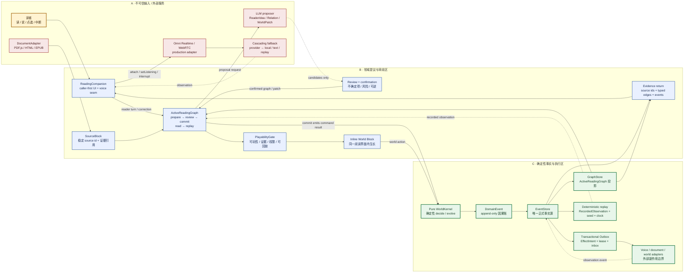

# Voice-Native Executable Book：语音、阅读关系图与可运行世界

> 状态：架构裁决 / 设计合同，不是生产实现
> 版本：0.1 / 2026-08-07
> 范围：`The Living Ledger` / 《国富论》Book I, Chapters I–III 首个产品切片
> 重要边界：本文描述接口、事实源、信任边界和演进顺序；不提交生产代码，也不把现有 Godot 价格上限场景当成最终经济机制。

## 0. 先看一次具体体验：第 10 页到第 12 页

架构先服务一条读者能看见、能中断、能追溯的路径：

1. 读者在第 10 页的分工段落旁按住耳机，说出自己的疑问。系统把这一句保存成一个可编辑的 Idea，作为**原文旁的页边便签**；原文、章节和她自己的话仍然同时可见。
2. 她读到第 12 页关于市场范围的段落，再说出第二个 Idea。第二张便签落在第二段旁边，而不是进入一个脱离书页的聊天记录。
3. Agent 提议把两张便签接成一条关系，并把“分工提高能力”与“市场太小时难以继续细分”说清楚。读者可以改写、拒绝或确认这条关系；Agent 没有替她提交事实。
4. 关系确认、证据齐全后，读者说：“已经可以玩了。”页面此时才征求主动语音并邀请试玩；她也可以拒绝麦克风，继续用文字完成同一条路径。
5. 两段原文之间长出一块小世界：针厂、工序、订单和运输路线都来自已确认的阅读关系。读者调整分工或市场范围，随时可以停下、重试或换一个办法。
6. 试玩结果再折回这两段原文：便签、读者的初始预测、世界发生过的结果和触发它们的关系并列出现。每个结果都能回答“哪一段文字、哪一次读者行动、哪一次世界事件”把它带到这里。

下面的接口、事实源和信任边界，都是为了让这条具体路径在断线、拒绝、重试和回放时仍然成立；它们不是产品入口本身。

## 1. 一句话决策

产品不是“给书加一个聊天框”，也不是“把 PDF 旁边嵌一个游戏”。它是一条由阅读激活的因果路径：

> **读者先读 SourceBlock、说出自己的理解并接通思想关系；关系图通过审阅后，Inline World Block 在同一阅读界面生长；世界事件再回写到同一组原文关系。**

四个架构裁决必须同时成立：

1. 前端采用 caller-first `ReadingCompanion`，调用方控制生命周期、监听状态和中断；组件不偷偷持有麦克风或会话。
2. 应用核心采用 Effect-Intent Hexagon：`EventStore` 是唯一事实源，`GraphStore` 只是投影，`WorldKernel` 是纯函数，外部效果通过 transactional outbox 执行。
3. LLM 只能提出 `ReaderIdea`、`Relation`、`WorldPatch` 候选；它不能提交关系、写世界或调用外部效果。
4. 文档适配器（PDF.js、HTML、EPUB 等）只负责取材；领域层以稳定的 `SourceBlock` 为准。世界在同一阅读界面以内嵌方式长出，`PlayabilityGate` 通过后才邀请读者主动语音。

## 2. 总体形态：从阅读到世界，再回到证据

下图是模块、事实源、信任边界和用户主链的合并视图。实线表示领域内的确定性调用或事件流；虚线表示候选、投影或观察，不代表拥有写权限。



### 2.1 事实源与投影

| 层 | 唯一职责 | 可以写什么 | 不可以写什么 |
|---|---|---|---|
| `SourceBlock` | 提供可核对的书籍语义锚点 | 文本、译文/释义、版本、段落、证据引用 | 运行时世界状态、模型结果 |
| `ActiveReadingGraph` | 管理当前阅读关系的 prepare/review/commit/read/replay 语义 | 候选节点、候选 typed edge、审阅意见、提交命令 | 直接修改 `EventStore` 历史、直接调用 LLM 之外的副作用 |
| `EventStore` | 保存正式因果历史 | append-only `DomainEvent`、外部 observation、版本 | 删除/覆盖历史、接受未校验 patch |
| `GraphStore` | 从事件重建关系图投影 | 节点/边查询、投影版本 | 直接成为第二事实源、绕过事件写边 |
| `WorldKernel` | 对已确认命令做确定性判定和状态演进 | `DomainEvent`、`EffectIntent`、风险声明 | 网络、时间、随机 UUID、LLM、直接写数据库 |

`GraphStore` 丢失时必须能够从 `EventStore` 重建；`ActiveReadingGraph.read()` 只能读取带有事件版本的投影，不能把缓存误报成最新事实。

## 3. 用户主链：每一步必须有可见状态

产品合同使用“用户行动 → 触发/状态 → 可见结果”，而不是把 BDD 改写成测试名或 Gherkin。下面的链路是首个可演示闭环：

| 步骤 | 用户行动 | 触发 / 状态转换 | 用户必须看到 |
|---|---|---|---|
| 1. 进入 | 打开阅读界面 | `ReadingSessionOpened`，加载当前 `SourceBlock` | 原文/释义、章节定位、稳定 source id；不会先弹出麦克风授权 |
| 2. 激活 | 点选或读完一个思想块 | `ReaderIdeaCandidate` 加入 `ActiveReadingGraph.prepare` | margin anchor、节点 active 状态、尚未提交的候选关系 |
| 3. 表达 | 说出“这两段有什么关系”，或输入文字 | `ReadingCompanion` 发出 final turn；LLM 仅生成候选 `ReaderIdea` / `Relation` | 可审阅的理解、证据引用、不确定字段；不会偷偷写图 |
| 4. 审阅 | 确认、修改或拒绝关系 | `ActiveReadingGraph.review`，形成带版本的确认意图 | typed edge、来源双方、置信度和“由谁确认” |
| 5. 提交 | 用户明确确认“运行这组关系” | `ActiveReadingGraph.commit` 发出 `GraphCommitted` 等 `DomainEvent` | 关系图进入正式事件账，按钮和版本状态变化 |
| 6. 生长 | 通过 `PlayabilityGate` 后点击运行 | `WorldSeeded`，`InlineWorldBlock` 展开；世界动作进入 `WorldKernel` | 世界从同一阅读界面内生长，不跳到旁挂窗口；每个行动有事件反馈 |
| 7. 语音邀请 | 世界证明可玩且有证据后，用户同意主动对话 | `VoiceInviteOffered` → `VoiceConsentGranted` → `attach/setListening` | 明确“开始听”“停止”“重试”；未通过 Gate 不主动打断阅读 |
| 8. 回写 | 点击回放/证据 | `read` 当前投影，按事件版本取证据 | source ids、typed edges、用户预测、世界事件、模型边界和可重放入口 |

### 3.1 Stop、权限、重试和未知分支

- **Stop**：读者可随时 `interrupt()`；语音 partial 不成为正式事件，未完成 effect 进入取消/过期状态，当前世界不会回滚到幻觉结果。
- **Permission**：麦克风、语音回放、外部文档上传、世界写入各自单独授权；拒绝时继续文字阅读，不伪装为“没有声音”。
- **Retry**：Provider timeout、WebRTC 断线、投影滞后显示可重试状态和 request/effect id；重试使用幂等键，不重复写交易或关系。
- **Unknown**：多解、缺证据、版本冲突、模型返回错误 schema 时停在 `needs_review`；界面显示“还不能确定”，而不是替用户选一个答案。

## 4. 前端合同：caller-first ReadingCompanion

`ReadingCompanion` 是一个由调用方驱动的前端能力，不是自动常驻的“语音组件”。页面/应用拥有它的生命周期，组件只提供能力和事件。

### 4.1 调用方责任

- 页面决定何时 `attach()`、何时开始/停止 listening、何时 `interrupt()`。
- 页面保存 `sessionId`、当前 `SourceBlock`、事件 cursor 和用户 consent；组件不把它们藏在单例里。
- 页面根据 `PlayabilityGate` 决定是否显示语音邀请；世界尚未可玩时不主动开麦。
- 页面只渲染结构化事件，不把模型自由文本当作事实。

### 4.2 语义接口（设计级 TypeScript，不是生产代码）

```ts
type ReadingCompanionState =
  | "detached"
  | "attached"
  | "listening"
  | "speaking"
  | "interrupted"
  | "error";

type ReadingCompanionEvent =
  | { type: "attached"; sessionId: string; sourceId?: string }
  | { type: "listening_started"; turnId: string }
  | { type: "partial_transcript"; turnId: string; text: string }
  | { type: "final_utterance"; turnId: string; text: string; audioRef?: string }
  | { type: "assistant_speaking"; responseId: string }
  | { type: "interrupted"; reason: "user" | "navigation" | "deadline" }
  | { type: "permission_required"; capability: "microphone" | "playback" }
  | { type: "error"; code: string; retryable: boolean; message: string };

interface ReadingCompanion {
  attach(input: {
    sessionId: string;
    sourceId?: string;
    consent: "not_granted" | "granted";
  }): Promise<void>;

  setListening(input: {
    enabled: boolean;
    reason: "reader_turn" | "world_invite" | "manual";
  }): Promise<void>;

  interrupt(reason?: "user" | "navigation" | "deadline"): Promise<void>;

  events(): AsyncIterable<ReadingCompanionEvent>;
}
```

`partial_transcript` 只用于临时 UI；只有 `final_utterance` 或明确的用户文字提交，才可进入应用层。`interrupt()` 是一等能力，不是关闭按钮的副作用。

### 4.3 生产语音适配器与确定性回放

生产路径优先使用 Omni Realtime / WebRTC adapter：

```text
ReadingCompanion
  → VoicePort.open(session policy)
  → Omni Realtime / WebRTC adapter
  → normalized VoiceObservation
  → domain command / UI event
```

若生产 provider 不可用，采用级联而非静默切换：

1. Omni Realtime / WebRTC：低延迟双向语音。
2. 受控的备用 provider 或本地语音 adapter：保持同一 observation schema。
3. 纯文字模式：明确说明“语音不可用”，保留阅读与世界路径。
4. `RecordedVoiceAdapter`：测试、演示和 deterministic replay 使用已记录 observation，不重新调用模型。

每条 voice observation 至少记录 `sessionId`、`turnId`、`streamSeq`、adapter id、provider/model 标识、时间/延迟、音频 hash 或安全引用、normalized payload。不要把 raw secret、长期 token 或未经授权的原始录音写进产品事件。

## 5. 应用核心：Effect-Intent Hexagon

Effect-Intent Hexagon 的中心不是“一个万能 Agent”，而是可重放的领域核心；六边形边界上的 adapter 只能提交 intent 或 observation。

### 5.1 六边形端口

```text
                           ┌────────────────────┐
                           │  ReadingCompanion  │
                           │  caller-first UI   │
                           └─────────┬──────────┘
                                     │ commands / observations
┌─────────────────────┐       ┌──────▼────────────────────┐       ┌──────────────────────┐
│ DocumentAdapter     │──────▶│  Application Use Cases     │◀──────│ VoicePort             │
│ PDF.js / HTML / EPUB│       │  Reader / Graph / World    │       │ Omni / fallback /     │
└─────────────────────┘       └──────┬────────────────────┘       │ recorded replay       │
                                     │                             └──────────────────────┘
                         ┌───────────▼───────────┐
                         │  Pure WorldKernel      │
                         │  state + command →     │
                         │  events + effects      │
                         └───────┬───────┬────────┘
                                 │       │
                    ┌────────────▼┐   ┌──▼────────────────┐
                    │ EventStore  │   │ Transactional     │
                    │ source of   │   │ Outbox / Inbox     │
                    │ truth       │   │ EffectIntent       │
                    └──────┬──────┘   └─────────┬──────────┘
                           │                    │
                    ┌──────▼──────┐      ┌──────▼─────────┐
                    │ GraphStore  │      │ External        │
                    │ projection  │      │ adapters        │
                    └─────────────┘      └────────────────┘
```

### 5.2 ActiveReadingGraph 语义

`prepare/review/commit/read/replay` 是用例语义，不等同于数据库表名：

- `prepare`：从 SourceBlock、用户文字或 final voice turn 生成候选节点/边；候选带 evidence refs、schema version、basis event version。
- `review`：呈现来源、typed edge、置信度、冲突和模型边界；用户可编辑、拒绝或要求重解释。
- `commit`：只有用户明确确认且 gates 通过后，提交领域命令；最终存储对象是 `DomainEvent`，不是 LLM JSON。
- `read`：按 cursor/version 从 EventStore 和 GraphStore 读取当前 active subgraph；投影落后必须返回 `ProjectionLag`，不能返回空图冒充没有关系。
- `replay`：使用记录过的 external observation、确定性 clock/id/seed 重放；与重新调用当前模型的 behavioral replay 分开报告。

示意事件序列：

```text
SourceBlockActivated
  → ReaderIdeaProposed
  → RelationProposed
  → RelationReviewed
  → GraphCommitted
  → WorldSeeded
  → WorldEvent*
  → EvidenceSnapshotProduced
```

### 5.3 领域接口（设计合同）

```ts
interface ActiveReadingGraphUseCase {
  prepare(input: PrepareReadingInput): Promise<PrepareResult>;
  review(input: ReviewReadingInput): Promise<ReviewResult>;
  commit(input: CommitReadingInput): Promise<CommandReceipt>;
  read(input: ReadGraphInput): Promise<Versioned<ActiveSubgraph>>;
  replay(input: ReplayInput): Promise<ReplayReport>;
}

interface WorldKernel {
  decide(state: WorldState, command: DomainCommand, env: DeterministicEnv): Decision;
  evolve(state: WorldState, event: DomainEvent): WorldState;
}

interface EventStore {
  load(aggregateId: AggregateId, fromVersion?: number): Promise<StoredEvent[]>;
  appendAtomically(input: AtomicAppend): Promise<AppendReceipt | ConcurrencyConflict>;
  subscribe(after: EventCursor): AsyncIterable<StoredEvent>;
}

interface GraphStoreProjection {
  project(event: StoredEvent): Promise<void>;
  query(input: GraphQuery): Promise<Versioned<ActiveSubgraph> | ProjectionLag>;
  resetAndRebuild(events: AsyncIterable<StoredEvent>): Promise<void>;
}

interface EffectOutbox {
  claim(batchSize: number, lease: Duration): Promise<EffectIntent[]>;
  markCompleted(effectId: EffectId, observationEventId: EventId): Promise<void>;
  markRetry(effectId: EffectId, retryAt: Instant, reason: PortError): Promise<void>;
  markDead(effectId: EffectId, reason: PortError): Promise<void>;
}
```

### 5.4 Effect 与 Intent 的规则

- `WorldKernel` 产生 `EffectIntent`，但不执行网络、语音、通知或模型调用。
- outbox 与 DomainEvent 在同一原子提交中写入；worker 以 lease claim，adapter 返回 observation，再以新 DomainEvent 回流。
- `effectId + requestHash` 提供幂等去重；交付语义是 at-least-once，业务结果不能因重试重复发生。
- provider 返回的模型身份、schema 或 basis version 不匹配时 fail closed；不把“差不多的 JSON”写成成功。

## 6. 领域数据与信任边界

### 6.1 SourceBlock 是跨文档格式的领域锚点

PDF.js、HTML、EPUB 都是 `DocumentAdapter`，不是领域真相。适配器把原始材料转换成统一的、可审计的 `SourceBlock`：

```ts
type SourceBlock = {
  sourceId: string;            // 稳定语义 id，例如 smith.b1.c1.division
  bookRevision: string;        // 版本和译本
  chapter: string;
  locator: { paragraph?: string; pageDisplay?: string };
  originalText?: string;
  translationOrGloss?: string;
  evidenceRefs: EvidenceRef[];
  boundary: "primary_text" | "honest_paraphrase" | "editorial_note";
};
```

页码只能作为显示信息，不能作为稳定身份。示例 source ids：

- `smith.b1.c1.division`
- `smith.b1.c2.exchange`
- `smith.b1.c3.market_extent`

适配器必须拒绝或隔离 PDF 内嵌脚本、外链自动动作、附件和超出资源上限的压缩数据。未经清洗的 PDF 内容不进入 LLM prompt 或世界命令。

### 6.2 候选、事件、效果

```ts
type ReaderIdea = {
  ideaId: string;
  sourceIds: string[];
  text: string;
  evidenceRefs: EvidenceRef[];
  confidence: "high" | "medium" | "low" | "unknown";
  status: "proposed" | "needs_review" | "accepted" | "rejected";
};

type Relation = {
  relationId: string;
  fromSourceId: string;
  toSourceId: string;
  type: string;                 // typed edge，不能是自由文本关系
  evidenceRefs: EvidenceRef[];
  basisVersion: number;
  status: "proposed" | "reviewed" | "committed";
};

type WorldPatch = {
  patchId: string;
  basisGraphVersion: number;
  operations: AllowlistedOperation[];
  inverseOperations: AllowlistedOperation[];
  evidenceRefs: EvidenceRef[];
  status: "proposed" | "reviewed" | "committed";
};

type DomainEvent = {
  eventId: string;
  aggregateId: string;
  aggregateVersion: number;
  type: string;
  causedBy?: string;
  payload: unknown;
  evidenceRefs?: EvidenceRef[];
  occurredAt: Instant;
};

type EffectIntent = {
  effectId: string;
  causedByEventId: string;
  basisVersion: number;
  adapterKind: "voice" | "document" | "world" | "notification";
  requestHash: string;
  payload: unknown;
  inverse?: unknown;
};
```

LLM 可以提议这四类结构化对象，但没有任何 LLM 返回值本身具有 commit 权限。`Relation` 没有 evidence refs 或 basis version 时不能进入 committed graph；`WorldPatch` 没有逆操作时不能过 gate。对已经 playable 的世界，读者明确提出的低风险 allowlisted action 可由 Harness 在同一 turn 编译并直接提交，该读者 turn 本身就是授权，不再展示审批或预览；假设、歧义、低置信或 stale 输入保持零修改。

### 6.3 信任边界矩阵

| 来源/模块 | 信任假设 | 可进入的层 | 必须阻断 |
|---|---|---|---|
| 用户文字/语音 | 真实表达，但可能含歧义、注入和越权要求 | `PrepareReading` 候选；playable world 中清晰、低风险、allowlisted 的 action 可由 Harness 编译为同轮命令 | 直接写图、直接改金额、绕过关系审阅或歧义/stale/action allowlist 守卫 |
| PDF.js/HTML/EPUB | 内容可能含脚本、提示注入、错误 OCR | 清洗后的 `SourceBlock` | 脚本执行、外链抓取、未经引用的事实 |
| LLM proposer | 非确定、可出错、不可授予执行权 | `ReaderIdea` / `Relation` / `WorldPatch` proposal | 直接提交 event、调用 adapter、发通知 |
| Omni/WebRTC/fallback | 外部服务可能断线或返回错误身份 | normalized observation | 未验证模型/schema、静默切 provider |
| `GraphStore` | 可重建、可能滞后 | 只读查询 | 作为第二事实源、直接写边 |
| `WorldKernel` | 纯函数、可回放 | DomainEvent + EffectIntent | I/O、随机副作用、LLM 解释结果 |
| `EventStore` | 权威 append-only | 正式状态历史 | 删除历史、覆盖旧版本 |
| `InlineWorldBlock` | 用户可见的世界投影 | 命令入口、事件渲染 | 未过 `PlayabilityGate` 就主动语音/写世界 |

## 7. Inline World Block 与 PlayabilityGate

世界不是阅读页旁的常驻 iframe。`InlineWorldBlock` 由 active graph 的提交事件创建，仍属于当前阅读上下文，并保留来源锚点、事件 cursor 和模型边界。

### 7.1 最小 Gate

只有以下条件全部满足，才把世界从静态解释提升为可玩块：

1. 至少一个有效 `SourceBlock` 和一个可核对的关系/命题；
2. 关系已通过 schema、evidence、冲突和用户确认；
3. `WorldKernel` 能在固定 seed/clock 下计算；
4. UI 能展示初始状态、可执行动作、停止/重试分支和事件账本；
5. 世界输出明确标注 `MODEL EXTENSION`，不冒充 Smith 原文；
6. replay fixture 能从事件和 recorded observation 重建同一结果。

Gate 未通过时只显示阅读/审阅状态，不主动邀请语音。通过后再显示“开始听我说 / 向世界提问”等显式入口，且第一次打开麦克风仍需 consent。

### 7.2 现有视觉原型边界

当前 `prototypes/living-ledger-shell` 中的 Godot 价格上限场景只承担视觉和点击运行的 placeholder：它证明“书页内可以长出世界”，不证明最终针厂或《国富论》的经济机制已经完成。生产替换它时，仍必须沿 `SourceBlock → ActiveReadingGraph → WorldKernel → DomainEvent → Evidence` 链路接入。

## 8. MVP 与明确非目标

### 8.1 MVP

- 一个阅读界面和三个稳定 source ids：Book I Ch I–III 的分工、交换、市场范围。
- caller-first `ReadingCompanion` 的 attach/listening/interrupt/events 合同；首版可先走文字和 recorded voice，保持与 Omni/WebRTC schema 一致。
- `ActiveReadingGraph` 的 prepare/review/commit/read/replay 语义；至少支持用户确认一条 typed edge。
- 一个确定性 `WorldKernel` 切片：小工坊/针厂、有限市场范围、生产/库存/订单/现金的可回放账本。
- `InlineWorldBlock` 和 `PlayabilityGate`；Gate 通过后能看到可执行动作和停止入口。
- EventStore 事件历史、GraphStore 投影、transactional outbox 的最小实现合同。
- evidence 返回页：source ids、关系、用户预测、世界事件、Smith text、模型简化、现代边界。

### 8.2 非目标

- 不做整本书 parser、PDF.js 产品化阅读器或通用 HTML/EPUB CMS。
- 不做“亚当·斯密聊天机器人”，不让 LLM 自由讲解并冒充原文。
- 不做任意宏观政策沙盘、无边界世界编辑器或 20 个每轮调用 LLM 的 NPC。
- 不把现有价格上限 Godot placeholder 当作最终经济机制，也不擅自改成别的机制。
- 不在没有对照实验前声称多 Agent 优于规则 actor；统一的用户可见界面/Agent 是 Agent OS，由阅读陪伴者、原文守护者、世界机制导演三个内部职责协作；Economic Agent 与规则 actor 不是独立聊天 NPC，经济事实仍只由确定性的 `WorldKernel` 决定。
- 截至 2026-08-07，第一方公开页面无法确认 2 或 5 分钟要求；用户提供的章程副本写复赛视频 ≤2 分钟、路演总时长 ≤4 分钟，但这不是在线第一方证据。因此项目按 2 分钟作为保守核心闭环设计约束，不宣称官方规则。

## 9. 失败分支与恢复合同

| 故障 | 用户可见状态 | 系统动作 | 禁止行为 |
|---|---|---|---|
| 语音权限拒绝 | “麦克风未开启，可继续文字阅读” | 保持 `attached`，不进入 listening | 反复弹窗、假装已听见 |
| WebRTC/Omni 断线 | “语音连接中断，重试或改用文字” | 结束当前流，保留 final turn，按级联策略重试 | 丢掉已确认 graph、重复提交 turn |
| Provider timeout/限流 | “语义建议暂不可用” | effect 入 outbox retry；文字阅读和已提交世界继续可用 | 生成假 `ReaderIdea` 或假成功 |
| LLM malformed/低置信度 | “需要你确认这段关系” | 保留 proposal，进入 `needs_review` | 自动选边、提交世界 |
| PDF 注入/解析超限 | “文档无法安全导入” | 隔离 artifact，记录 warning/error，允许换文档 | 执行嵌入脚本或把原文直塞 prompt |
| Graph projection lag | “关系图正在同步” | 返回 `ProjectionLag` 和 cursor，稍后重读 | 把空图显示成“无关系” |
| EventStore 并发冲突 | “页面已有新版本，请重新确认” | 重新加载事件，重算 proposal；保留用户草稿 | 覆盖较新事实 |
| WorldKernel 不变量失败 | “这组关系暂时不能运行” | 不 append world events；展示可修正原因 | 让 LLM 直接改数绕过校验 |
| 用户中断语音 | “已停止” | `interrupt()`，partial 丢弃/标记取消，final 事件保留 | 继续录音或继续播报 |
| replay mismatch | “回放与原记录不一致” | 阻断发布/演示结论，保留 mismatch 报告 | 用当前模型结果覆盖历史 |

## 10. 两分钟核心闭环（保守设计约束，不宣称官方规则）

截至 2026-08-07，第一方公开页面无法确认 2 或 5 分钟要求；用户提供的章程副本写复赛视频 ≤2 分钟、路演总时长 ≤4 分钟，但这不是在线第一方证据。下列流程因此按 2 分钟作为保守核心闭环设计约束，用来验证“边读边说，关系接通后世界生长”，不把 2 分钟写成官方规则。

| 相对时间 | 屏幕 / 用户动作 | 可见证明 |
|---|---|---|
| 0:00–0:15 | 阅读 Book I Ch I 的 division SourceBlock；点亮 margin anchor | 原文、译文/释义、稳定 source id；没有聊天框抢主角 |
| 0:15–0:30 | 阅读 Ch III market extent，用户口述“市场范围会限制分工” | `ReadingCompanion` final turn；候选 typed edge 带两端证据 |
| 0:30–0:45 | 审阅并确认 `division -- constrained_by --> market_extent` | `ActiveReadingGraph.commit`；`GraphCommitted` / 版本号可见 |
| 0:45–1:00 | `PlayabilityGate` 通过，Inline World Block 从页内展开 | 世界标注 source ids 与 `MODEL EXTENSION`，不是旁挂窗口 |
| 1:00–1:25 | 用户运行一个针厂组织方案，观察产出、库存和订单 | `WorldKernel` 产生可核对 DomainEvent；用户可 stop/retry |
| 1:25–1:40 | 用户改变市场范围/运输条件，重跑同一关系 | 同一 graph、不同条件、不同事件账本；不是 LLM 随机讲故事 |
| 1:40–1:52 | 世界回写 evidence | source ids、typed edge、用户预测、事件和模型边界并列 |
| 1:52–2:00 | Gate 通过后才出现“主动语音邀请”；用户可接受或继续文字 | permission/stop 分支可见；不强制开麦 |

演示中使用的针厂、市场范围和事件数只是最小 fixture；它们不构成现代经济预测，也不替代正式用户测试。

## 11. 生产演进路线

### Phase 0：语义与视觉 PoC

- DOM/Canvas 阅读 shell、稳定 SourceBlock、active graph 和现有 Godot placeholder。
- recorded voice 或文字先验证 caller-first 事件合同。
- 手工 replay fixture 验证“同一关系 → 同一世界结果”。

### Phase 1：确定性 MVP

- 建立 append-only EventStore 和可重建 GraphStore projection。
- `WorldKernel` 覆盖针厂工序、熟练、切换、订单、库存、现金、市场范围和运输延迟。
- 加入 transactional outbox、idempotency、version conflict、PlayabilityGate 和 evidence snapshot。
- 用真实浏览器路径验收 reader → graph review/commit → world → evidence。

### Phase 2：生产语音与文档适配

- Omni Realtime / WebRTC production adapter；实现级联 fallback 和明确 consent。
- PDF.js、HTML、EPUB adapters 统一产出 SourceBlock；加入文档清洗、版本、证据和缓存策略。
- 用 recorded observation 做 exact replay；用当前模型做 behavioral replay，分开报告模型漂移。

### Phase 3：可扩展世界与研究闭环

- 在不改变领域事实源的前提下，增加更多 Book I 关系、Book V 人的代价和 Book IV 语境对照。
- 只有对照实验显示规则 actor 不足时，才在局部引入 Economic Agent；它不作为独立用户可见聊天 NPC，统一的用户可见界面/Agent 仍是 Agent OS（由阅读陪伴者、原文守护者、世界机制导演三个内部职责协作），经济事实仍由确定性的 `WorldKernel` 决定。
- 建立投影重建、outbox 崩溃恢复、PDF fuzz、provider contract、property-based kernel 和 golden replay 套件。

### Phase 4：部署与运营

- 公网 HTTPS、后端 Agent 接口、自建 MCP（若选择）分别进行合同探查；不把本机端口当在线证明。
- 指标关注：关系确认率、理解回放成功率、世界可玩率、语音中断/重试率、replay mismatch，而不是生成文字量。
- 每次发布保存 source revision、graph version、world version、adapter/model version 和可回滚快照。

## 12. 架构验收清单

- [ ] `ReadingCompanion` 的 attach/setListening/interrupt/events 由 caller 控制，partial 不写正式账。
- [ ] EventStore 是唯一事实源；GraphStore 可删除重建。
- [ ] `WorldKernel` 无 I/O、时间、随机和 LLM 依赖；相同输入可重放。
- [ ] `ActiveReadingGraph` 的 commit 落成 DomainEvent，而不是保存模型 JSON 作为事实。
- [ ] LLM 输出只属于 ReaderIdea/Relation/WorldPatch proposal；缺证据或低置信度停在 review。
- [ ] PDF.js/HTML/EPUB 经过 DocumentAdapter，领域身份由 SourceBlock/source id 提供。
- [ ] Inline World Block 由 PlayabilityGate 创建；模型边界可见。
- [ ] 生产语音使用 Omni/WebRTC adapter、级联 fallback 和 RecordedVoiceAdapter replay。
- [ ] stop/permission/retry/unknown 分支在 UI 和事件账本中均可见。
- [ ] 两分钟流程作为保守核心闭环设计约束；截至 2026-08-07 不宣称任何官方时长规则。
