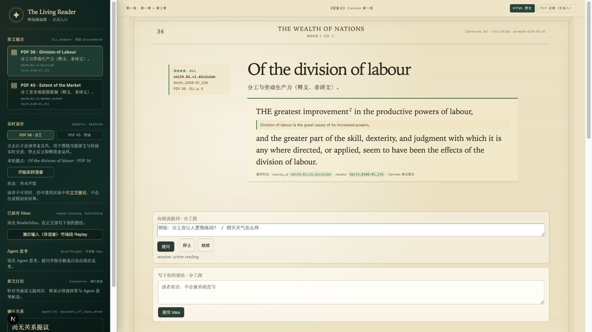
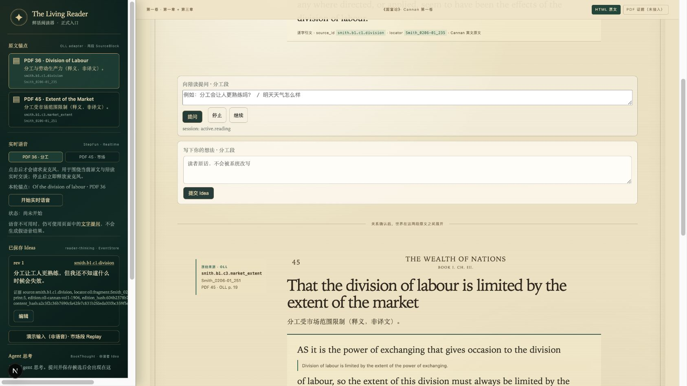
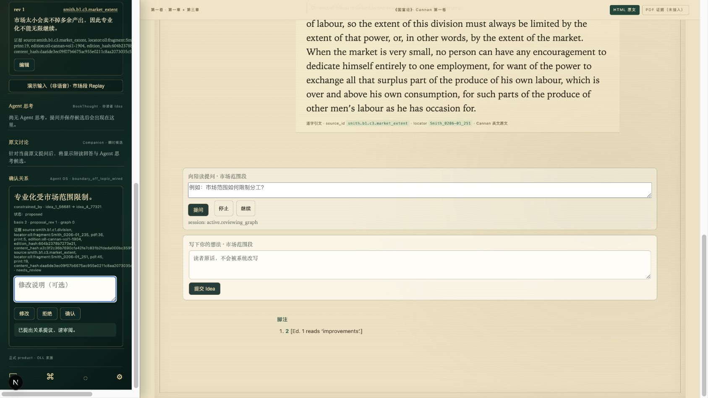
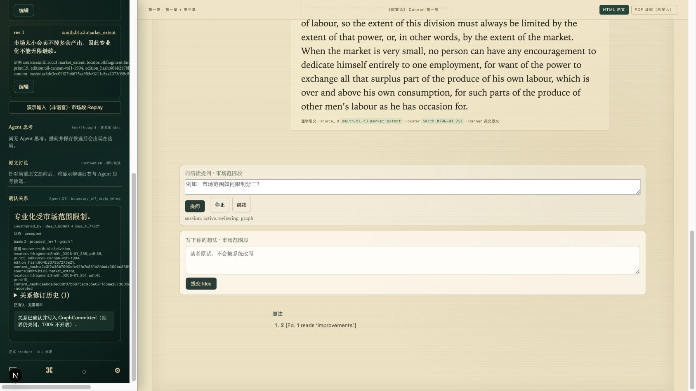
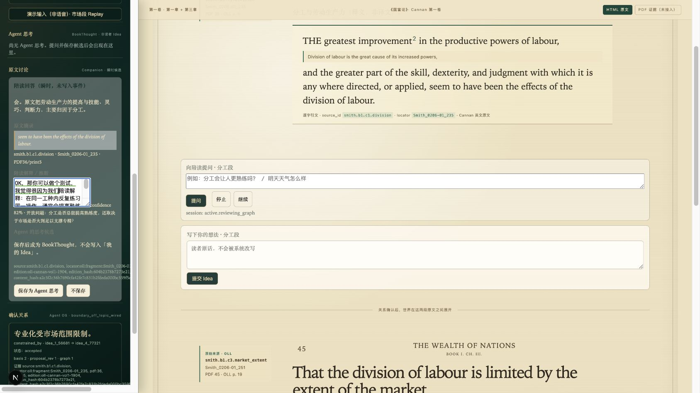
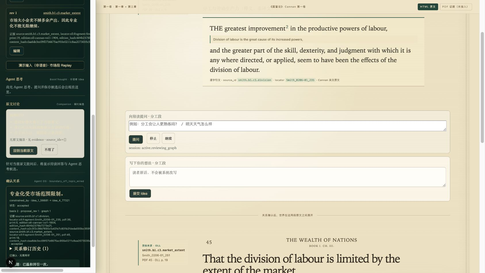
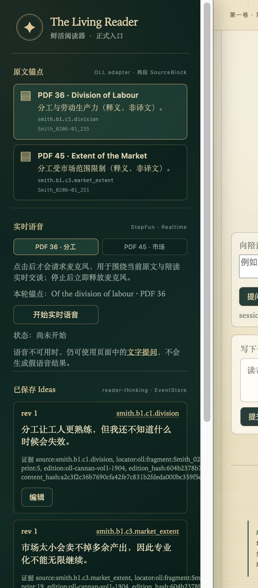

# UI/UX 定位审计：鲜活阅读器

> 日期：2026-08-09
> 范围：当前 `product/` 本地界面、核心阅读链路、360 × 800 移动视口
> 设计输入：`/Users/mahaoxuan/Downloads/私人与共享/` 中的 Purpose、Agency、Responsibility、Familiarity、Craft、内容层与 UI 层、渐进式揭示、反馈、引导、布局、字体、动效、可访问性和 Generative AI 笔记

## 结论

当前视觉主方向成立：深绿 Agent 轨道与暖纸阅读面已经让“书”和“系统”形成区分。但界面还没有把这种区分落实为交互层级——Agent 轨道堆叠了过多工程状态，两个表达入口互相竞争，关系与回应离原文太远，移动端则无法进入正文。

下一轮不应先增加装饰，而应先完成三个结构动作：让书重新取得主要注意力；让每一步只出现此刻需要的操作；让关系、世界和证据在同一段原文附近连续发生。

## 笔记如何落到项目

| 设计原则 | 本项目中的具体含义 |
|---|---|
| Purpose | 每个常驻面板和功能都消耗读者注意力；不能因为系统有状态就全部展示。 |
| Agency | 读者控制节奏，可确认、拒绝、修改、暂缓、停止和重试；Agent 不替读者提交事实。 |
| Responsibility | 麦克风在使用语音时再授权，说明原因；AI 回应标明来源、推断和限制。 |
| Familiarity | 操作层使用熟悉的输入、抽屉、展开和返回模式；独特视觉集中在内容与世界。 |
| Progressive Disclosure | 当前一步在前，技术依据和未来能力按需展开；必要的来源与不确定性不能被隐藏。 |
| Feedback | 保存、候选、接受、拒绝、跑题、停止和失败都要有立即、连续、可恢复的可见结果。 |
| Craft | 先修复对比度、字号、触达尺寸、换行、滚动与移动布局，再谈额外视觉效果。 |
| Generative AI | Agent 给候选而非结论；读者能拒绝、修改、重试，并保有完整文字路径。 |

## 实际用户链路

### 1. 进入阅读 — 方向成立，信息密度偏高

书页在桌面占主位，色彩和材质方向清楚；但轨道从首屏起同时展示锚点、语音、Ideas、Agent 思考、讨论和关系，读者还没行动就需要理解整套系统。

### 2. 留下第一条想法 — 可用，两个入口竞争

保存路径可完成，但“向陪读提问”和“写下你的想法”在同一原文下以近似大小、近似视觉权重出现，增加选择成本，也让读者难以建立稳定心智模型。

### 3. 形成关系候选 — 领域合同正确，位置与语言不对

第二条想法能触发候选关系，但候选位于深轨道而非两段原文之间；`constrained_by`、ID、hash 和 graph revision 抢在人的判断之前。应先解释“这两个想法如何相互约束”，再让读者展开依据。

### 4. 接受关系 — 状态已提交，因果连续性不足

接受动作有反馈，但主阅读面没有明显表现“关系已把两段原文接通”；世界位置仍是工程占位语。下一步需要从原文锚点、关系到 World Slot 的空间连续动作。

### 5. 查看陪读候选 — 来源边界正确，窄轨道不可扫描

引文、推断、置信状态和开放问题被挤在固定窄轨道里。内容本身应靠近当前 SourceBlock 展开，轨道只保留摘要、未决状态与召回入口。

### 6. 跑题回引 — 行为正确，视觉反馈失效

系统能温和回到书中问题，但浅色卡片继承了深色轨道的浅色文字，正文几乎不可见。这是当前最直接的视觉阻断之一。

### 7. 360 × 800 移动视口 — 阻塞

页面存在 `min-width: 1040px`，主壳固定为 `338px + 正文` 两列；移动端只看见被放大的轨道，正文位于视口之外。移动端应先显示单栏书页，Agent 收进抽屉或底部层。

## 设计优先级

| 优先级 | 要解决的体验 | 验收信号 |
|---|---|---|
| P0 | 移动端阅读壳 | 360px 宽度下无横向滚动，正文先出现，Agent 可召回。 |
| P0 | 对比度、字号、触达与长证据换行 | 跑题卡可读；轨道没有 8px 关键信息；操作不会因长 ID 溢出。 |
| P0 | 轨道信息架构 | 默认只显示当前步骤、必要状态和下一动作；工程证据按需展开。 |
| P1 | 统一表达入口 | 原文下只有一个主输入，问题/观察/假设仍可被系统和读者辨认。 |
| P1 | 原文附近的关系与回应 | 候选关系和 Agent 回应与触发 SourceBlock 保持空间联系。 |
| P2 | Inline World 展开与证据回归 | 世界从两段原文之间展开；结束后能沿事件链返回同一原文。 |

## 代码定位

- 阅读壳、轨道和内容顺序：`product/src/components/ReadingShell.tsx`
- 全局布局、移动端、字号、对比度和溢出：`product/src/app/globals.css`
- 两个表达入口：`SourceDiscussionComposer.tsx`、`ReaderIdeaComposer.tsx`
- 关系候选：`RelationReviewCard.tsx`
- 陪读候选：`CompanionAnswerCard.tsx`
- 跑题反馈：`SoftReturnCard.tsx`
- 世界插槽：`ReadingShellClient.tsx`

## 本轮证据边界

本轮在当前本地产品中走通了文字输入、关系候选、接受关系、陪读候选、拒绝和跑题回引，并检查了 360 × 800 视口；过程中未观察到浏览器 console 错误或警告。

这不是完整可访问性或生产验收：未测试真实麦克风授权、键盘全链、屏幕阅读器、200% 缩放、reduced motion、真实 PDF compositor 和尚未实现的 Inline World。截图也只能证明当前可见状态，不能替代后续交互验收。
