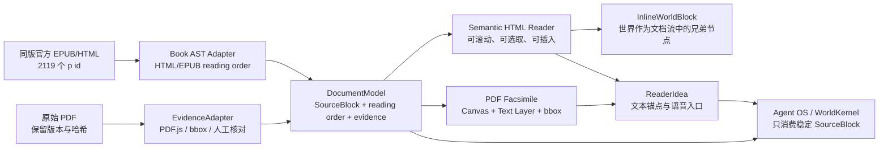
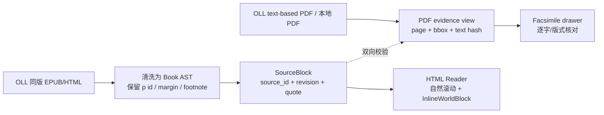
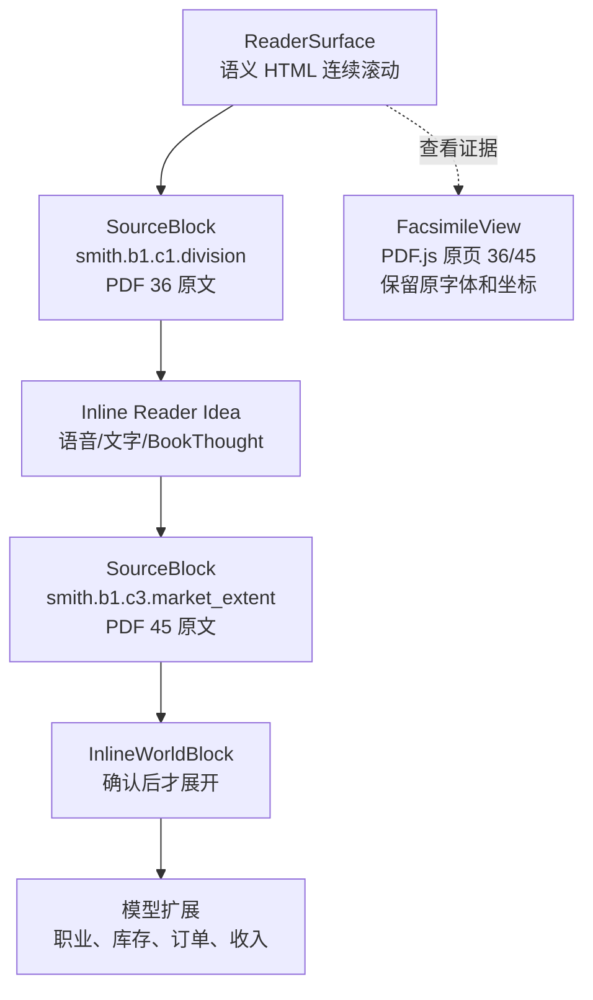

# Living Reader 文档运行时方案研究

> 研究日期：2026-08-08
>
> 目标：判断《国富论》PDF 36/45 的阅读界面是否应改为 HTML、EPUB 或混合运行时，并确定段落锚点与可变高度交互块的实现边界。

## 结论先行

应该采用 **HTML-first Book AST + PDF evidence view**，但不应该把原 PDF 一次性“转换后替代掉”。本项目最合适的不是 `PDF → 新 PDF`，也不是 `PDF → 一份未经校验的 HTML`，而是：

> **同版、可校验的 HTML/EPUB 作为阅读与插入的内容真相；原 PDF 保留为证据与版式视图；两者由同一个 SourceBlock/Anchor 模型连接。**

这次判断有一个比“自己把 PDF 转 HTML”更强的依据：Online Library of Liberty 为同一版 Cannan vol. 1 提供官方 ePub；ePub 内的 `Smith_0206-01.html` 含 **2119 个带 `id` 的 `<p>` 段落节点**。同页还明确说明其 text-based PDF “was created from the HTML version of this book”。因此对当前两分钟 MVP，可以从这份同版 HTML/EPUB 选择目标段落（如 `Smith_0206-01_235` 与 `Smith_0206-01_251`），再用本地 PDF 36/45 做版式与逐字 evidence 对照；世界块作为正常 DOM 流中的 `InlineWorldBlock` 插入。不要先做整本自动解析，也不要把 PDF.js text layer 误当成语义 HTML。

HTML 会显著改善滚动、选取、可变高度插入和无障碍，但不会自动解决“PDF 转段落”的困难。真正的核心是一个稳定的文档中间表示：



## 先纠正“Vibero / Yibero”这个名字与能力判断

可公开验证的产品名是 **Vibero**，不是 Yibero：

- [Vibero 官网](https://vibero.dev/) 的标题和公开 GitHub 项目均使用 `Vibero`。
- [Vibero 公共仓库 README](https://github.com/chenyu-xjtu/Vibero) 目前把 “Paragraph summaries” 与 “Draggable chat / layout” 列在 `Planned / TODO`，已发布项写的是 AI chat、全文总结和协作式代码阅读。因此，不能把公开仓库当成线上商业版逐段 Canvas 的完整源码。
- [`.gitmodules`](https://github.com/chenyu-xjtu/Vibero/blob/main/.gitmodules) 显示其 `reader` 指向 [zotero/reader](https://github.com/zotero/reader)，并另接 `pdf-worker` 与 `note-editor`。这能确认它是围绕 Zotero Reader 扩展，而不是修改 PDF 文件格式。
- 公开源码仍然能验证“共享语义对象”的思路：[ContextPane](https://github.com/chenyu-xjtu/Vibero/blob/main/chrome/content/zotero/elements/contextPane.js) 处理自定义 `application/x-zotero-vibecard-reference` 拖拽；[Reader bridge](https://github.com/chenyu-xjtu/Vibero/blob/main/chrome/content/zotero/xpcom/reader.js) 把引用转交给 AI Chat；[AI Chat](https://github.com/chenyu-xjtu/Vibero/blob/main/ai-chat/src/index.jsx) 再按卡片 ID 解析内容。

因此，能可靠借鉴的是 **Reader + 语义对象 + 引用桥**，而不是声称已经看到了 Vibero 商业版的完整段落 renderer。

## 决定性证据：OLL 已经提供同版 HTML/EPUB

这条证据改变了本项目的优先级：我们不需要先把现有 PDF 自动“转换成 HTML”再猜哪些段落正确。

[Online Library of Liberty 的 Cannan vol. 1 页面](https://oll.libertyfund.org/title/smith-an-inquiry-into-the-nature-and-causes-of-the-wealth-of-nations-cannan-ed-vol-1) 同时列出三种资源：`EBook PDF`、`ePub` 和 `Facsimile PDF`。页面对 `EBook PDF` 的说明是 **“This text-based PDF or EBook was created from the HTML version of this book”**，并将该版标为 1904 年 Cannan edition、正文 public domain（页面 lines 40–70 可核对）。官方 ePub 下载地址为：

`https://oll-resources.s3.us-east-2.amazonaws.com/oll3/store/titles/237/smith-an-inquiry-into-the-nature-and-causes-of-the-wealth-of-nations-cannan-ed-vol-1.epub`

对该官方 ePub 做的只读检查结果：

- 内容包中的 `Smith_0206-01.html` 是单一正文 HTML 资源；
- HTML 有 **2119 个 `<p>` 节点，且 2119 个都带 `id`**；
- 段落 ID 形如 `Smith_0206-01_235`、`Smith_0206-01_251`，分别对应 Book I Chapter I 的分工段落和 Book I Chapter III 的市场范围段落；
- 段落内部还保留 `<span class="type-margin">` 边注与脚注链接，说明需要在 AST 中区分正文、边注、脚注，而不是把所有文本简单串接。

这不是说 EPUB 的 ID 可以直接冒充我们最终的领域 ID：它们属于 OLL 资源版本，升级或换版时仍需记录 `book_revision`，并用 exact/prefix/suffix 及 PDF bbox 做双向校验。但它已经提供了一个**比 PDF text item 聚合可靠得多的同版初始阅读顺序与段落边界**。

因此本项目的输入优先级应调整为：



对 PDF 36/45 的含义：先找出官方 HTML 中与当前页面正文相对应的 `p id`，再建立 `source_id ↔ PDF page/bbox` 映射。PDF 页面号仍是证据视图的显示信息，不是唯一领域 ID。

## 一手资料核对结果

### 1. PDF.js：不是 PDF 转 HTML，而是页面渲染层加 DOM 文本层

[PDF.js 官方 API](https://mozilla.github.io/pdf.js/api/draft/module-pdfjsLib.html) 将 PDF 页面文本暴露为 `TextContent.items`。每个 `TextItem` 有 `str`、`transform`、`width`、`height`、`fontName`、`hasEOL` 等字段，但没有通用的“段落 ID”。同一 API 也有 `StructTreeNode`，但它依赖 PDF 自身存在结构树。

[官方 TextLayer 源码](https://github.com/mozilla/pdf.js/blob/master/src/display/text_layer.js) 会把 text items 变成 HTML `span`，依据 viewport/transform 定位；[官方 TextLayerBuilder](https://github.com/mozilla/pdf.js/blob/master/web/text_layer_builder.js) 明确写的是“creating overlay divs over the PDF's text”，并用这些 div 做选择、复制和高亮。

结论：PDF.js 的常规路径是：

```text
PDF bytes → canvas 视觉层
          → text layer（定位的 HTML span）
          → annotation layer / app overlay
```

它不是把 PDF 变成一个可自由重排的 HTML 文档。我们当前 PDF 的 `pdfinfo` 结果是 `Tagged: no`，因此不能指望从 PDF.js 直接得到可靠语义段落；必须自行聚合 text items，或使用更强的结构化提取器并人工复核。

### 2. Zotero Reader：同时支持 PDF、EPUB、HTML，但把结构抽取单独建模

[Zotero Reader README](https://github.com/zotero/reader) 明确将自己定义为 “PDF/EPUB/HTML reader and annotator”，仓库中同时包含 `pdfjs`、`epubjs` 和 `structured-document-text` 相关组件。

更关键的是 Zotero 的独立仓库 [structured-document-text](https://github.com/zotero/structured-document-text)：

- SDT 保存 normalized document tree、metadata、outline、page mappings、source anchors 和 text ranges；
- `content` 保存结构化文本块；
- 用 `.sdt` pack 做分块和随机访问；
- 明确列出的用途包括 reading mode、PDF text layer、结构化 Agent context、section-level chunking。

这正是我们需要的中间层形状。我们不必复制 Zotero 的二进制 pack，但可以采用同一思想：**格式只是输入适配器，SourceBlock/DocumentModel 才是产品运行时的内容真相。**

### 3. EPUB / Readium：天然支持重排和连续滚动，但不是“把 PDF 完美转换”的工具

[W3C EPUB 3.3](https://www.w3.org/TR/epub-33/) 定义 EPUB 为封装 HTML/XHTML、CSS、SVG 和其他资源的分发格式；默认面向 reflowable 内容，也支持 fixed-layout。其 [EPUB Overview](https://www.w3.org/TR/epub-overview-33/) 说明阅读系统可按屏幕、字号和用户偏好重新排版。

[EPUB Reading Systems 3.3](https://www.w3.org/TR/epub-rs-33/) 还定义了 `rendition:flow` 的 `scrolled-continuous`：阅读系统可以把 spine item 作为一条连续可滚动的阅读流。这与“段落之间插入世界块”方向一致。

但 EPUB 的脚本和宿主修改有约束；EPUB 规范的脚本模型不是为“任意 Agent 把宿主阅读器 DOM 改成游戏”设计的。我们若采用 EPUB，应把它当作**输入/分发格式**，由自己的 Reader 把清洗后的 XHTML 读入自己的 DOM，再把世界块放在宿主 DOM 中，而不是把交互逻辑塞进一个普通 EPUB 包里。

[Readium Web](https://readium.org/web/) 目前定位为构建 Web Reader 的 toolkit，明确区分：Go toolkit 将出版物暴露成 Web Publication API，TypeScript toolkit 负责 navigator；目前重点支持 EPUB，PDF 仍是未来计划。[Readium Web Publication Manifest](https://readium.org/webpub-manifest/) 的 `readingOrder` 可以列出 HTML 资源，`resources` 可列 CSS、图片等资源。

因此，Readium 的价值主要是借鉴 **出版物清单、reading order、资源和 navigator 边界**，而不是直接替换当前 PDF MVP。

### 4. 锚点：不要只存页码，也不要只存一个 DOM ID

[W3C Web Annotation Data Model](https://www.w3.org/TR/annotation-model/) 定义了 CSS、XPath、Text Quote、Text Position、Data Position、SVG 等 selector；它允许一个 Target 同时携带多个 selector。

[Readium Annotations](https://github.com/readium/annotations) 给出了非常实用的组合：

- `CssSelector` 定位最近的共同 DOM 祖先；
- `TextPositionSelector` 记录 Unicode code point 的 start/end；
- `TextQuoteSelector` 保留 exact/prefix/suffix；
- `ProgressionSelector` 用于排序/回退；
- 读取时优先使用最精确 selector，失败后退回其他 selector。

对 PDF，额外必须保留页面几何信息，因为 PDF 没有稳定的 DOM 段落：`pageIndex + normalized bbox/quad + exact/prefix/suffix + textHash + bookRevision`。对 HTML/EPUB，使用 `source_id + CSS selector + text position + quote`，并在渲染后重新计算当前 DOM 的 `Range.getBoundingClientRect()`。

这意味着“第 10 页”只是显示定位，不是领域 ID；同一个 `SourceBlock` 可以同时拥有 PDF 和 HTML 两套 evidence selector。

### 5. Vivliostyle / Paged.js：适合分页出版，不是本项目首选阅读运行时

[Vivliostyle Viewer](https://docs.vivliostyle.org/en/viewer/vivliostyle-viewer/) 的定位是 typeset HTML+CSS 文档，并支持 Web publications 和未压缩 EPUB；[Vivliostyle 文档](https://docs.vivliostyle.org/en/) 也强调 HTML → WebPub/PDF/EPUB 的单源多输出。

[Paged.js](https://pagedjs.org/en/about/) 是浏览器内把 HTML 分页并生成 PDF 的 polyfill；它的 [handlers/hooks](https://pagedjs.org/en/documentation/10-handlers-hooks-and-custom-javascript/) 允许在分页前后处理内容。

二者能帮助我们做“像书一样的分页 HTML”，但它们会重新分页。插入一个动态世界块后，后面的页码、页边和分页断点都可能改变；这反而会放大我们现在要解决的“滚动与 inline block”问题。若未来需要导出漂亮 PDF/EPUB，可以把它们放在发布链路，不要把它们当成当前 Agent 世界的主阅读表面。

### 6. MuPDF：适合离线结构化提取，不建议直接作为浏览器 UI 依赖

[MuPDF StructuredText](https://mupdf.readthedocs.io/en/1.28.0/reference/javascript/types/StructuredText.html) 将页面分析为 blocks、lines、spans，并可输出 `asHTML()` 或带 bbox/font/text 的 `asJSON()`；其提取选项包括 `paragraph-break`、`dehyphenate`、`segment`、`table-hunt` 等。[`mutool draw` 文档](https://mupdf.readthedocs.io/en/1.23.0/mutool-draw.html) 也明确支持 HTML、XML/JSON structured text 输出。

这比 PDF.js 的低级 text items 更接近我们的 ingestion 需求，但许可证必须单独评估：[MuPDF license](https://mupdf.readthedocs.io/en/1.26.3/license.html) 是 AGPL 或商业授权。当前比赛原型可以把 MuPDF 当成离线/构建时工具，不能未经确认就把 MuPDF.js 作为线上产品依赖。

## 方案比较

| 方案 | 原文版式 | 滚动/选取 | 插入可变高度块 | 锚点难度 | 当前判断 |
|---|---|---|---|---|---|
| OLL 同版 EPUB/HTML → Book AST | 不保留印刷分页，但正文/边注/脚注可追溯 | 最自然：原生滚动、选择、DOM 插入 | 最简单：兄弟节点或边界节点 | 中低：已有 p id，仍需 revision/quote/PDF mapping | **当前 MVP 的首选输入与阅读源** |
| PDF.js Canvas + TextLayer + overlay | 最高 | 页面级，缩放/拖动体验受 page geometry 影响 | 只能放在页外、切页或复杂 compositor 中 | 高：page + quad + quote | 保留为 Facsimile / 证据视图 |
| PDF → absolute HTML | 近似原版式，但仍是坐标布局 | 比 canvas 可选，但仍像一张页 | 仍然需要改 page coordinate；不是真正流式段落 | 高：转换器仍不给稳定段落 ID | 只做实验/提取，不做产品真相 |
| PDF → 语义 HTML（人工核对） | 不保证印刷版式 | 最自然：原生滚动、选择、DOM 插入、无障碍 | 最简单：兄弟节点或边界节点 | 中：CSS + position + quote + revision | OLL 源不可用时的后备方案 |
| EPUB/XHTML + Readium | 重排友好；可做固定布局 | 强；连续流/字号适配成熟 | 宿主 Reader 可插入，包内脚本受限 | 中：CFI/CSS/TextPosition/Quote | 未来输入/分发格式，不是当前替代品 |
| Vivliostyle / Paged.js | 分页 HTML 质量高 | 偏分页 | 动态块会触发重新分页 | 中到高 | 发布/导出链路使用 |
| MuPDF StructuredText | 提取 block/line/span/bbox 强 | 不负责产品 UI | 输出中间层后再由 HTML 插入 | 中：提取强但需人工校验 | 构建时 ingestion 候选 |
| Zotero SDT-like JSON | 不负责视觉 | 交给自己的 Reader | 最容易在 block 之间插入 | 低到中，取决于 source selector | 直接借鉴的数据模型 |

## “Frame”应该怎么命名

`Frame` 可以作为 Figma/CSS 的视觉容器名，但不适合作为领域概念。建议统一用以下词：

| 产品概念 | 含义 |
|---|---|
| `SourceBlock` | 书中的可核对语义单元，通常是一段、标题、脚注或跨页段落 |
| `BlockAnchor` / `TextRangeAnchor` | SourceBlock 在某种文档格式中的定位信息 |
| `InsertionPoint` | 两个 SourceBlock 之间允许插入内容的位置 |
| `InlineWorldBlock` | 插入阅读流、可展开/收起、包含角色反应和状态的交互组件 |
| `ReaderSurface` | 用户实际阅读和滚动的整体界面 |
| `DocumentAdapter` | PDF/HTML/EPUB 的读取与证据转换层 |
| `FacsimileView` | 原 PDF 的精确核对视图 |

本项目最准确的一句话是：

> **在 `SourceBlock` 的 `InsertionPoint` 插入一个 `InlineWorldBlock`，而不是在 PDF 里插入一个 Frame。**

## 对当前 PDF 36/45 的具体建议

### 推荐的双表面布局



1. **主阅读面**：使用 OLL 同版 HTML 中经过核对的 `<article>`/`<p>`，自然滚动。每个书段都带 `data-source-id`、`data-book-revision`、`data-text-hash`；原始 OLL `p id` 可作为 `source_locator` 留存，但不代替本项目自己的 revision-scoped ID。
2. **交互块**：`InlineWorldBlock` 是 SourceBlock 的兄弟节点，默认占据文档流高度；它展开时后续文本自然下移，收起时高度归零，不需要切割 canvas。
3. **原页核对**：用户点“查看 PDF 36/45”时打开 PDF.js facsimile；页面显示当前 SourceBlock 的 bbox/quote 命中，不把 PDF 当成主要交互面。
4. **Agent OS**：只消费 `SourceBlock` 与 `ReaderIdea`，不读取 DOM 像素，也不把当前滚动位置当成来源。
5. **语音**：在当前 HTML SourceBlock 上发起语音时冻结 `source_id + revision + quote`；录音结束后即使用户滚动，也仍写回开口时那一段。

### 两分钟纵切的最小 HTML 数据

```json
{
  "book_revision": "cannan-vol1-rev1",
  "blocks": [
    {
      "source_id": "smith.b1.c1.division",
      "source_locator": "Smith_0206-01_235",
      "kind": "paragraph",
      "order": 36,
      "html": "<p>...</p>",
      "evidence": {
        "pdf": {"page": 36, "bbox": [0.15, 0.32, 0.84, 0.44]},
        "quote": {"exact": "...division of labour.", "prefix": "", "suffix": ""}
      }
    },
    {
      "source_id": "smith.b1.c3.market_extent",
      "source_locator": "Smith_0206-01_251",
      "kind": "paragraph",
      "order": 45,
      "html": "<p>...</p>",
      "evidence": {
        "pdf": {"page": 45, "bbox": [0.15, 0.34, 0.84, 0.53]},
        "quote": {"exact": "...extent of the market.", "prefix": "", "suffix": ""}
      }
    }
  ]
}
```

这里的 `order: 36/45` 只是当前 demo 的阅读顺序/证据页提示，不是 ID；OLL 的 `source_locator` 也只是来源版本中的 locator。稳定身份仍是 `source_id + book_revision + text_hash`。真正生产数据应使用完整 exact/prefix/suffix 和经过核对的 bbox/quad，不应只保留省略号。

## 迁移步骤

### Phase 0：先做可视化对照，不改 Agent OS

- 引入 OLL 同版 EPUB/HTML 作为只读 ingestion 输入；只渲染 PDF 36/45 对应的两个经过核对的 HTML SourceBlock（`Smith_0206-01_235`、`Smith_0206-01_251`），不要先处理整本 2119 段。
- 新增 `ReaderSurface=flow`，并把每个 SourceBlock 映射回本地 PDF 的 page/bbox evidence。
- 保留现有 `ReaderSurface=facsimile` 作为 PDF.js 证据模式。
- 同一组 `SourceBlock`、`ReaderIdea`、`MechanismGraph`、`WorldKernel` 复用，不复制状态。
- 只做滚动、选择、语音冻结锚点和 `InlineWorldBlock` 展开/收起的浏览器验收。

### Phase 1：建立文档中间表示

- 从 OLL HTML/EPUB 生成 `.sdt-like.json`（不是直接引入 Zotero 二进制格式）：blocks、reading order、outline、原始 `source_locator`、page mapping、selectors、revision、hash。
- PDF.js 继续供浏览器渲染与逐字核对；构建时可比较 MuPDF StructuredText 或 Poppler bbox 输出。
- OLL HTML 中的边注（`span.type-margin`）、脚注和页码标记必须进入人工 review；PDF 双栏、页眉页脚、旁注、跨页段落也必须进入人工 review。无法唯一定位的 block 标记 `needs_review`，不能给 Agent 造成假锚点。

### Phase 2：再评估 EPUB/Readium

当需要完整书籍、多设备字体适配、章节导航或离线分发时，把 HTML SourceBlock 打包为 EPUB/Web Publication；Readium 负责 publication/navigation，Agent OS 仍只依赖 SourceBlock。不要让 EPUB 包内脚本直接拥有 WorldKernel 权限。

## 当前必须避免的误区

1. **不要把 PDF 转出来的 HTML 当作原文真相。** 若有 OLL 同版 HTML/EPUB，应优先使用该版本；任何转换结果仍是 derived artifact，必须回指 book revision、HTML locator 和 PDF quote/evidence。
2. **不要只用页码或当前滚动位置做 ID。** 缩放、重排、插入世界块都会使它们漂移。
3. **不要先做整本自动 parser。** 当前 MVP 只有两个目标段落；先验证自然阅读和世界插入是否真的改善体验。
4. **不要把 Paged.js/Vivliostyle 当成连续阅读层。** 它们适合分页与导出，动态世界块会导致重新分页。
5. **不要直接把 MuPDF.js 带进线上产品而不审许可证。** AGPL/商业授权是独立决策。

## 一手来源索引

- [PDF.js Getting Started](https://mozilla.github.io/pdf.js/getting_started/)
- [PDF.js API: TextContent / TextItem / StructTree](https://mozilla.github.io/pdf.js/api/draft/module-pdfjsLib.html)
- [PDF.js TextLayer source](https://github.com/mozilla/pdf.js/blob/master/src/display/text_layer.js)
- [OLL Cannan vol. 1 title page: EBook PDF / ePub / Facsimile PDF](https://oll.libertyfund.org/title/smith-an-inquiry-into-the-nature-and-causes-of-the-wealth-of-nations-cannan-ed-vol-1)
- [OLL official Cannan vol. 1 ePub](https://oll-resources.s3.us-east-2.amazonaws.com/oll3/store/titles/237/smith-an-inquiry-into-the-nature-and-causes-of-the-wealth-of-nations-cannan-ed-vol-1.epub)
- [Zotero Reader](https://github.com/zotero/reader)
- [Zotero Structured Document Text](https://github.com/zotero/structured-document-text)
- [Vibero](https://github.com/chenyu-xjtu/Vibero) / [Vibero submodules](https://github.com/chenyu-xjtu/Vibero/blob/main/.gitmodules)
- [Readium Web](https://readium.org/web/)
- [Readium Web Publication Manifest](https://readium.org/webpub-manifest/)
- [Readium Annotations](https://github.com/readium/annotations)
- [W3C Web Annotation Data Model](https://www.w3.org/TR/annotation-model/)
- [W3C EPUB 3.3](https://www.w3.org/TR/epub-33/) / [EPUB Overview](https://www.w3.org/TR/epub-overview-33/) / [EPUB Reading Systems](https://www.w3.org/TR/epub-rs-33/)
- [Vivliostyle Viewer](https://docs.vivliostyle.org/en/viewer/vivliostyle-viewer/)
- [Paged.js](https://pagedjs.org/en/about/) / [Paged.js handlers](https://pagedjs.org/en/documentation/10-handlers-hooks-and-custom-javascript/)
- [MuPDF StructuredText](https://mupdf.readthedocs.io/en/1.28.0/reference/javascript/types/StructuredText.html) / [`mutool draw`](https://mupdf.readthedocs.io/en/1.23.0/mutool-draw.html) / [MuPDF license](https://mupdf.readthedocs.io/en/1.26.3/license.html)

## 本地 PDF 的核对记录

对仓库中的 `assets/public-domain/wealth-of-nations-cannan-vol1.pdf` 做了只读检查：`pdfinfo` 显示 462 页、A4、`Tagged: no`、无 JavaScript。使用 Poppler `pdftohtml -xml` 检查第 36/45 页时，主正文在 `x≈135`，旁注在 `x≈615`，页眉/页脚也被单独输出；这证明“把 text items 按文件顺序串起来”会把旁注、页眉和正文混在一起。该输出只用于研究和对照，没有写回仓库资产。
对官方 OLL ePub 也做了只读检查：包内 `Smith_0206-01.html` 有 2119 个 `<p>`，且每个都有 `id`；`Smith_0206-01_235` 的正文以 “THE greatest improvement…” 开头，`Smith_0206-01_251` 的正文以 “AS it is the power of exchanging…” 开头，均保留边注/脚注节点。该检查只用于研究，没有写回仓库资产。

**最终判断：** 现在应做“同版 HTML/EPUB Book AST Reader + PDF Facsimile evidence view”的双表面原型，而不是把产品押在 PDF-to-HTML 自动转换或完整 EPUB Reader 上。`InlineWorldBlock` 是插入物的正确产品名；`Frame` 只保留给 Figma/CSS 视觉容器。
