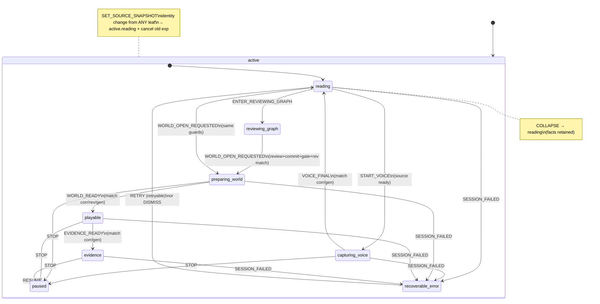

# ReaderSession statechart (T004)

XState **5.32.5** core only. Machine orchestrates *what is allowed*; **EventStore remains sole fact source**. Context stores IDs/revisions only — never economic metrics, full events, or model output.

## Mermaid

## States

| State | Meaning | world-slot data-state |
|-------|---------|------------------------|
| `active.reading` | Default reading | closed |
| `active.capturing_voice` | Voice capture in flight | closed |
| `active.reviewing_graph` | Relation review UX | closed |
| `active.preparing_world` | World prepare effect | loading |
| `active.playable` | World open | open |
| `active.evidence` | Evidence surface | open |
| `paused` | STOP — effects cancelled via generation bump | closed |
| `recoverable_error` | Typed failure | closed |

## Events (typed)

| Event | Carries |
|-------|---------|
| SET_SOURCE_SNAPSHOT | experience_id, source_snapshot_ids[] |
| START_VOICE | — |
| VOICE_FINAL | correlation_id, effect_generation (required) |
| ENTER_REVIEWING_GRAPH | — |
| RELATION_REVIEWED | relation_id, basis_revision |
| GRAPH_COMMITTED | graph_revision, accepted_relation_ids[] |
| PLAYABILITY_PASSED | graph_revision |
| WORLD_OPEN_REQUESTED | graph_revision |
| WORLD_READY | correlation_id, graph_revision, world_id, world_revision, effect_generation |
| EVIDENCE_READY | correlation_id, effect_generation (required) |
| STOP / RESUME | — |
| SESSION_FAILED | code, message, retryable |
| RETRY / DISMISS / COLLAPSE | — |

## Guards

| Guard | Rule |
|-------|------|
| sourceSnapshotReady | snapshot ids non-empty |
| sourceIdentityChanged | experience_id or sorted source ids differ |
| playabilityMatchesGraph | review+commit+gate at same graph_revision as request |
| worldReadyMatches | correlation + graph_revision + effect_generation |
| voiceFinalMatches / evidenceReadyMatches | correlation + effect_generation |
| canResumePlayable/Evidence | paused_from + world basis revision still matches graph |
| errorRetryableAndFresh | error.retryable; basis_generation == effect_generation |

## Completions & source switch (F26/F27)

1. VOICE_FINAL / WORLD_READY / EVIDENCE_READY always require matching `correlation_id` + `effect_generation` (and graph_revision for WORLD_READY). Mismatch / wrong phase / paused → `STALE_COMPLETION` or `MISSING_COMPLETION_BASIS`, zero mutation.
2. STOP bumps `effect_generation` and clears correlation; late completions cannot revive cancelled runs.
3. **Source identity change** (experience or source set) from *any* leaf — including capturing, preparing, playable, evidence, paused, recoverable_error — **atomically targets `active.reading`**, clears derived relation/graph/gate/world, bumps generation, and emits `cancel_all` for the **previous** `experience_id` (not the new one).
4. Same-identity SET_SOURCE_SNAPSHOT only refreshes ready flags; state is unchanged.

## Public API boundary (F29)

| Surface | Exports |
|---------|---------|
| `modules/session` (production barrel) | types, ports, `safeAttemptTransition`, getters, `worldSlotStateFromSession` |
| **Not** in production barrel | `readerSessionMachine`, `createSessionActor`, `SessionActor`, `sessionReplayHash`, any `node:crypto` hash |
| `reader-session.test-harness` | test-only actor factory + replay hashes |
| `ReaderSessionProvider` / `useReaderSession` | `state`, `context`, `worldSlotState`, `send` only — no raw actor |

`reader-session.transition.ts` must **not** statically import `reader-session.hash` / `node:crypto` so client chunks stay free of crypto-browserify.

## Deterministic replay (F28)

Whole-run hash = SHA-256 of:

1. normalized transition **receipt sequence** (accepted, states, reason_code, requested_effects, context_fingerprint)
2. **final** state + full context fingerprint

Same event sequence → same hash. Changing any receipt reason/effect/fingerprint or final snapshot changes the hash.

## Reason codes (rejections are never silent)

`SOURCE_NOT_READY`, `RELATION_NOT_REVIEWED`, `GRAPH_NOT_COMMITTED`, `PLAYABILITY_NOT_PASSED`, `GRAPH_REVISION_MISMATCH`, `CHRONOLOGY_VIOLATION`, `RELATION_BASIS_MISMATCH`, `STALE_COMPLETION`, `MISSING_COMPLETION_BASIS`, `NOT_RETRYABLE`, `STALE_RETRY`, `INVALID_TRANSITION`, …

## Invariants

1. Machine does not write EventStore / IndexedDB / Kernel / mic.
2. STOP increments `effect_generation`; late completions → `STALE_COMPLETION`.
3. COLLAPSE returns to reading; does **not** delete world/EventStore facts.
4. Same event sequence → same whole-run receipt+snapshot hash (no Date.now / random).
5. Test bridges only when `NEXT_PUBLIC_T004_SESSION_BRIDGE=1` (and T003 env for EventStore).
6. Raw `actor.send` must not bypass chronology — app code always uses `safeAttemptTransition`.

## Files

- `src/modules/session/**` (incl. `reader-session.test-harness.ts`, Node-only `reader-session.hash.ts`)
- `src/components/ReaderSessionProvider.tsx`
- `src/components/T004SessionTestBridge.tsx`
- `tests/unit/session/**`
- `tests/e2e/reader-session.spec.ts`
