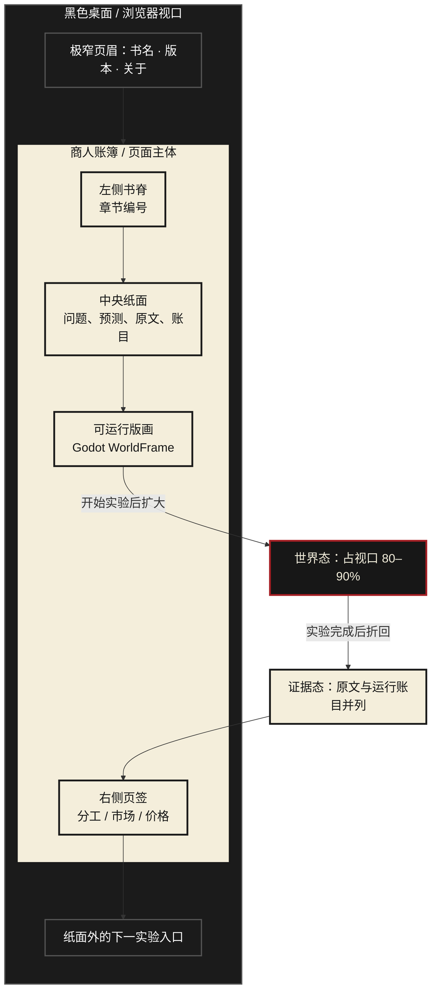

# Executable Book：书与可运行世界如何共处

> 调研日期：2026-08-07  
> 范围：网页信息架构与视觉布局，不包含产品代码改动  
> 当前结论：不要做永久左右分栏；使用“账簿 → 世界 → 证据页”的形态转换

## 1. 先给结论

《国富论》不应该以 PDF、电子书阅读器或常驻左栏出现。那会把“书”降级成说明书，把“世界”压缩成一个小组件。

更合适的核心隐喻是：

> **一本 18 世纪商人账簿，里面夹着一块可以运行的城市版画。**

读者打开账簿，先留下自己的判断；版画从页面中扩展为几乎全屏的世界；实验结束后，世界折回账簿，运行记录、Smith 原文和模型边界被写入页边。

书不是游戏旁边的另一块内容。书是世界的容器、证据和记忆。

## 2. 参考网站真正值得借鉴的东西

### Cargo Templates：每个视口只让人判断一个对象

[Cargo Templates](https://cargo.site/templates) 的模板选择页没有把大量控制器堆在中心。主内容被放进一个占据大部分视口的独立框体，名称、编号和切换动作退到边缘，大量留白让用户只判断当前对象。

可借鉴：

- 游戏是页面中央唯一的视觉主角；
- 章节、来源和控制动作退到边缘；
- 不做赛事官网式的顶栏、侧栏、指标卡和聊天框拼盘；
- 每一屏只提出一个阅读问题或允许一个核心动作。

### Mosby’s Files：先选择一个“知识对象”，再组织所有内容

[Mosby’s Files 的 I. M. Pei 页面](https://www.mosbyfiles.com/cases/i-m-pei) 使用黑色舞台、黄色文件夹、白色纸张、索引标签、照片、图纸和剪报构成一个可滚动档案。项目的 [About 页面](https://www.mosbyfiles.com/about) 明确说明，它想制造的不是干燥目录或教材，而是打开旧文件夹、站在研究者桌前翻看材料的感觉。

可借鉴：

- 整个页面遵守一个强隐喻，而不是若干风格组件的集合；
- 页签同时承担导航、物理感和章节记忆；
- 正文、照片、注释、图纸可以重叠，但主次始终清楚；
- 黑色背景把纸面变成独立舞台；
- 下一章入口始终在纸面之外，阅读进度不用做成 SaaS 进度条。

不能照搬：

- 黄色文件夹、剪刀和照片拼贴属于 Mosby 的档案语境；
- 《国富论》应该换成账簿、票据、价格牌、印章和版画；
- 页面不能只“看起来像历史材料”，每个物件必须连到实验状态或原文证据。

## 3. 互动文章怎样把“阅读”和“运行”接起来

| 案例 | 它如何布局 | 对本项目的启发 | 不应照搬的部分 |
|---|---|---|---|
| [Mechanical Watch](https://ciechanow.ski/mechanical-watch/) | 段落提出局部问题，紧接一个可拖拽模型；同一零件名称在文字和模型中颜色一致 | 原文概念应在用户需要它时贴着世界出现；互动图不是插图，而是论证的一步 | 长篇连续文章不适合两分钟比赛演示 |
| [Parable of the Polygons](https://ncase.me/polygons/) | 短文、模拟、问题轮流出现；先运行，再问读者观察到了什么 | 先让用户造成后果，再揭示概念；每轮只改一个变量 | 固定宽度和卡通语气不适合作为视觉基底 |
| [Distill: Grand Tour](https://distill.pub/2020/grand-tour/) | 精确正文包围可暂停、可拖动的解释图；图中状态和段落论点同步 | “原文、模型、现代边界”可作为可核对的证据层，而不是结尾书评 | 学术论文版式太冷，缺少书作为对象的身份 |
| [The Book of Shaders](https://thebookofshaders.com/) | 目录、章节和传统书籍排版建立“这是一本书”的认知 | 章节索引、版本、引用位置仍然必要 | 仅做目录与长文会重新退回电子书 |

这些案例共同说明：最有效的结构不是“先读完，再打开游戏”，而是：

## 4. 三个候选布局

### A. 永久左右分栏

左侧 30% 原文，右侧 70% 游戏。

优点：开发简单，书始终可见。  
问题：游戏永远像网页里的 iframe；人物和场景再次变小；手机端崩溃；用户会把原文当操作说明。  
结论：**淘汰。**

### B. 长篇滚动式互动文章

正文与若干 Godot 场景依次排列，滚动触发模拟。

优点：阅读顺序清楚，容易解释完整背景。  
问题：两分钟演示节奏被滚动打断；反复创建 WebGL 场景成本高；容易变成带动画的课程网页。  
结论：适合作为赛后深读版，不适合作为首屏主体验。

### C. 账簿与世界形态转换

同一个视觉对象在三个状态间变化：

1. **账簿态**：封面、章节页签、问题和预测；
2. **世界态**：页内版画扩展到 80–90% 视口，书脊与页签仍留在边缘；
3. **证据态**：世界缩回，运行日志成为账目，旁边展开原文与模型边界。

优点：书和世界具有因果关系；游戏保持足够大；两分钟演示有明确的视觉高潮；可复用同一个 Godot 实例。  
结论：**推荐。**

## 5. 推荐布局：The Living Ledger

### 桌面端

建议比例：

- 桌面背景：全屏近黑色；
- 账簿：宽 `min(1180px, 82vw)`；
- 账簿态纸面：正文有效宽度 620–760px，左边缘保留账目与版本信息；
- 世界态：Godot 画面占视口宽度 80–90%，只保留 48–64px 书脊和页签；
- 证据态：世界约 58%，证据页约 42%，只在结果已经发生后出现分栏；
- 1BIT 画面只使用黑/象牙白；网页外壳可以加入一种深朱红，用于印章、警告和因果线。

### 移动端

移动端不要强行保留左右并列：

- 账簿变成单页；
- Godot 世界保持完整宽度和固定宽高比；
- 原文与账目使用底部抽屉；
- 页签变成顶部横向章节条；
- 每次只展开世界或证据之一，禁止横向滚动。

## 6. 两分钟演示中的页面节奏

| 时间 | 页面形态 | 用户看到什么 |
|---|---|---|
| 0:00–0:12 | 账簿态 | 《国富论》版本、一个问题、读者的预测框 |
| 0:12–0:22 | 展开 | 纸面上的黑白版画扩大为世界 |
| 0:22–1:15 | 世界态 | 用户输入行动；城市、人物和账本同步变化 |
| 1:15–1:35 | 后果停顿 | 短缺、积压或职业迁移留在画面中，不立即解释 |
| 1:35–1:52 | 折回 | 世界缩回账簿，事件变成可核对的账目 |
| 1:52–2:00 | 证据态 | Smith 原文、可执行模型和现代边界分层出现 |

这个节奏保留了游戏的视觉完整性，同时让评委在结尾明确看见：体验来自一本具体的书，而不是一个套了历史皮肤的经济游戏。

## 7. 信息层级

每个实验只保留四层：

1. **Reader Prediction**：读者原先怎么想；
2. **Executable World**：世界实际怎样运行；
3. **Smith Text**：原文在说什么，带版本与章节定位；
4. **Model Boundary**：哪些是我们为了运行而增加的假设，哪些是现代争议。

这四层不能同时铺满屏幕。它们通过形态转换依次获得主导权。

## 8. 技术落点（只定义边界，不开始实现）

- 网页外壳：普通 DOM/CSS，负责账簿、页签、原文、引用与响应式布局；
- 世界：一个持续存在的 Godot Web 导出实例，不因滚动反复销毁；
- 状态同步：网页向 Godot 发送 `experiment:start` / `action:confirm`，Godot 返回 `world:event` / `experiment:complete`；
- 运行结果先落入结构化事件账本，再由网页排版成页边记录；
- 原文永远由网页层提供并带版本定位，不放进 Godot 贴图；
- 首屏不加载长篇全文，只加载当前实验需要的摘录和说明。

## 9. 下一步的设计验证

下一轮不要直接造完整站点。先做一个只有三个状态的高保真壳：

1. 账簿封面与问题页；
2. 当前 1BIT Godot 样片从纸面扩展到世界态；
3. 结果折回后显示原文、账目和模型边界。

用同一条价格干预演示即可；这一步只验证“书是否真的拥有世界”，不锁定最终经济机制。

