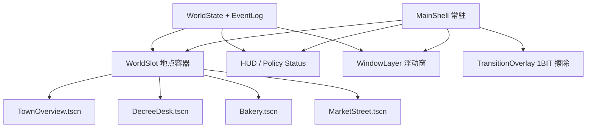

# 「野火深林 1BIT RPG」参考视频复刻规范

> 日期：2026-08-07  
> 目的：先把用户给出的 15.8 秒参考视频拆清楚，再决定是否沿这条视觉路线深挖。本文只定义视觉、交互与技术复刻边界，不修改现有 prototype。  
> 证据：本地 [视频](/Users/mahaoxuan/Desktop/一本书/素材管理/人到达有多懒才想起来要做这个功能%20%5B6a74629400000000210223c1%5D.mp4)、[原帖说明](/Users/mahaoxuan/Desktop/一本书/素材管理/人到达有多懒才想起来要做这个功能%20%5B6a74629400000000210223c1%5D.description)、[元数据](/Users/mahaoxuan/Desktop/一本书/素材管理/人到达有多懒才想起来要做这个功能%20%5B6a74629400000000210223c1%5D.info.json)。

## 结论先行

这段视频最值得复刻的不是“黑白像素滤镜”，而是下面这套完整语法：

1. **地点真的切换**：探索地图与战斗场景不是同一张大地图换几个图标，而是镜头尺度、人物大小、UI 分区全部重组。
2. **人物足够大**：探索主角约占屏宽 10%，战斗敌人约占屏宽 17%–19%。观众能看清角色姿态，而不是辨认一个小点。
3. **窗口也是玩法**：菜单会收起，战斗指令区会消失，日志区随之扩大；原帖也明确说这一版加入了“UI 窗口浮动大小”。
4. **每次状态变化都有四层反馈**：角色动作、数值/血条、空间中的短促特效、日志追加同步发生。
5. **转场属于美术系统**：场景通过黑场与 1BIT 网点擦除切换，不是普通网页淡入淡出。

因此，《国富论》样片如果继续沿用一个总览小镇，让所有人物都缩成图标，即使套上黑白像素皮肤，仍然没有学到这个案例的核心。正确方向是：**3–4 个可切换的近景经济场所，每次只让观众看清一个正在承担后果的人。**

## 一、源文件可确认信息

- 视频为 H.264，`624 × 932`，30 fps，474 帧，时长 `15.8s`。这是社交平台录制规格，不等于游戏内部设计分辨率。
- 原帖说明明确写到“战斗日志完全重写”“一堆技能细节描述”“UI 上做了窗口浮动大小”。
- 原帖标签包含 `#像素美术`、`#godot`，作品名为“野火深林 1BIT 挂机 RPG”。因此可以确认作者使用 Godot；不能由此推断其具体节点树、shader 或窗口实现代码。
- “严格两色”是从作品名和画面风格得到的强信号，但视频压缩、录屏和平台转码会引入灰阶。不能用录屏中的每个灰度值反推原始 palette。

## 二、0–15.8 秒逐段拆解

下表中的尺寸来自对 `624 × 932` 代表帧的近似测量，误差约 ±2–3%。它们是复刻基准，不是作者公布的设计稿。

| 时间 | 场景与镜头 | 人物占屏比例 | UI 窗口 | 动效与转场 | 节奏作用 |
|---|---|---|---|---|---|
| `0.00–0.70s` | 俯视探索地图，中近景；地图只显示一个房间/区域，不展示世界全貌 | 主角/怪物单体约屏宽 8%–10%、屏高 7%–9% | 顶部 HP/等级 HUD 常驻；下半屏打开黑底菜单，六个大像素图标和设置项占约 49% 高度 | 世界仍在菜单后可见；右下有明确的像素化尺寸/移动把手 | 第一拍先展示“这是一个可操作的软件物件”，不是纯动画 |
| `0.70–1.20s` | 同一探索场景，世界画面重新获得空间 | 人物尺度不变 | 大菜单向下收起/缩小，约 0.5 秒内退出画面 | 不是页面跳转；世界持续渲染，UI 让位给场景 | 用一次窗口变化证明 UI 与世界共存 |
| `1.20–2.33s` | 俯视地图推进；主角在近距离内移动并靠近目标 | 主角约 `60–65 × 80–85px`，约屏宽 10%、屏高 9% | 顶部 HUD 与左侧状态块仍在；底部只留窄控制条 | 有短 walk/idle 帧、地面影子和朝向变化；镜头不做炫技运镜 | 给观众约 1 秒建立地点、人物与即将发生的关系 |
| `2.33–3.25s` | 探索场景内发生遭遇/击中 | 人物尺度不变 | 临时反馈条在角色附近出现，例如数值、素材/效果名 | 命中瞬间有姿态变化、飞行/接触特效、浮动数字/标签；反馈持续不足 1 秒 | 把“碰到目标”变成清晰事件，而不是静默改状态 |
| `3.25–3.53s` | 探索场景退出 | — | HUD 与世界一起退出 | 黑色从左向右覆盖；交界处是约 30–60px 的 Bayer/网点抖动带。完全黑场前的运动约 0.2 秒 | 明确结束一个地点与尺度 |
| `3.53–3.68s` | 短黑场 | — | — | 约 0.15 秒停顿 | 给大脑一次“章节断句” |
| `3.68–3.95s` | 战斗场景进入 | 初始先出现 UI，角色随后从左右边缘进入 | 战斗 UI 随左→右的网点擦除逐步显现；背景、血条、下方面板共同建立 | 与退出方向一致，仍为左→右 reveal；角色晚于场景约 0.1 秒进入 | 用非常短的仪式感宣布玩法状态改变 |
| `3.95–5.85s` | 横向对峙战斗近景；上半屏是舞台，下半屏是操作与日志 | 玩家约屏宽 9%–10%；敌人约屏宽 17%–19%、屏高约 14%–16% | 敌我血条直接贴近各自区域；下半屏为“正在引导/技能资源/战斗记录/逃跑” | 攻击采用短距离冲刺、单一 projectile/impact sprite、伤害浮字、血条跳变、日志追加 | 角色终于足够大，观众能看到剪影、朝向与受击 |
| `5.85–9.60s` | 同一战斗舞台持续运行 | 人物保持大尺寸，不因信息增多而缩小 | 指令/资源面板收起，战斗记录扩大到整个下半屏；原帖所说的窗口尺寸变化在此最明显 | 自动战斗继续；每轮约 1–1.5 秒产生一次“动作→数字→血条→日志”链 | 给日志呼吸空间，同时不牺牲人物可读性 |
| `9.60–11.30s` | 战斗收尾 | 同上 | 指令区恢复，日志缩回；用户又能看到当前技能/资源 | 最后一击的 projectile、impact、血条归零在约 0.5 秒内完成 | 先恢复操作结构，再给出决定性一击 |
| `11.30–12.40s` | 敌人从舞台消失，玩家留场 | 玩家仍约屏宽 10%；敌人位置留白 | 日志保留最终伤害记录 | 没有立刻弹窗；留约 1 秒空拍确认“对象已经不在了” | 让死亡/退出成为可观察结果，而不是一条文字 |
| `12.40–15.80s` | 战利品/结算叠层覆盖下半部，战斗背景仍可见 | 玩家仍留在背景；结算中另有较大的敌人/物品像素插图 | 黑底、浅色细边的模态窗依次增加：胜利标题 → 记录/距离 → 掉落物 → 确认按钮 | 信息不是一次全部出现，而是约每 0.5–0.8 秒加一层；最后确认按钮获得高亮 | 用逐级揭示制造奖励感，并保留战斗发生过的空间证据 |

### 15.8 秒的节奏骨架

关键不是事件多，而是每一拍只回答一个问题：我能操作什么 → 我碰到了谁 → 场景为何改变 → 谁在承担状态变化 → 结果是什么。

## 三、可确认事实与合理推断

| 判断 | 级别 | 依据或限制 |
|---|---|---|
| 项目使用 Godot、像素美术，并自称 1BIT RPG | **可确认** | 原帖标签和说明直接写明 |
| 本次更新重点包括战斗日志、技能细节、UI 窗口浮动大小 | **可确认** | 原帖说明直接写明 |
| 探索与战斗使用不同的场景构图和 UI 布局 | **画面可确认** | 3.25–3.95 秒发生完整黑场擦除，进入后人物尺度和页面分区改变 |
| 擦除边缘使用网点/抖动图案 | **画面可确认** | 逐帧可见黑场边缘的规则点阵过渡 |
| 角色、图标、字体和 UI 使用同一低分辨率像素语言 | **画面可确认** | 所有元素都保持硬边、统一线宽与无抗锯齿观感 |
| 源游戏的内部逻辑分辨率约为 `312 × 466`，再 2×放大 | **合理推断** | 录制尺寸为 624×932，像素块接近 2×；但录屏链路可能再次缩放，不能确认为项目设置 |
| 世界/角色由 `Sprite2D`、`AnimatedSprite2D` 或 `TileMapLayer` 组成 | **合理推断** | 这是 Godot 中常见且匹配画面的方式；没有源码证据 |
| 浮动窗口由自定义 `Control` 拖拽/resize 实现 | **合理推断** | 画面和说明证明能力存在，但作者可能使用其他 Control 组合或插件 |
| 网点转场由 `CanvasItem` shader 完成 | **合理推断** | 也可能是预渲染遮罩序列、AnimationPlayer 控制的纹理或 sprite sheet |
| 战斗区、日志区使用 `SubViewport` 隔离 | **不应声称** | 仅凭画面无法确认；普通 Control 层级同样可以完成 |

## 四、真正需要模仿的视觉系统

### 1. 镜头与构图

- 总览场景不是鸟瞰城市，而是**只看一个可互动地点**；角色在探索画面中也不能低于约屏宽 8%。
- 冲突/访谈/生产细节必须换到近景：主角约屏宽 10%，核心对象约 16%–20%。
- 场景里的留白用于动作和浮字，不拿 KPI 卡、折线图或节点连线填满。
- 不使用连续自由缩放来替代场景设计。参考视频依靠切镜头，而不是把同一张地图放大。

### 2. 1BIT 资产规则

- 最终画面只使用黑、白两种实体色；中间值只能由规则抖动网点形成。
- 人物、建筑、字体、图标、血条、光标与边框必须来自同一像素网格和线宽体系。
- 所有 sprite 使用 nearest filtering，并落在整数坐标；缩放只使用整数倍。
- 角色靠清晰剪影区分职业：面包师的帽/围裙、工人的工具、商人的账本、执法员的徽章。不能靠旁边的小字标签补救不可读剪影。
- 白色大面积不是纯平面：参考画面有细横线/点阵纹理。但该纹理必须极轻，不能压过人物轮廓。

### 3. UI 规则

- 黑底窗口、浅色标题条、1px/2px 像素边框；不出现现代圆角卡片、玻璃模糊、柔和阴影或渐变按钮。
- 日志不是右侧外挂 dashboard，而是与世界共享同一个游戏窗口，可收起、扩大、回放。
- 面板改变大小时，人物舞台不缩成邮票；优先收起次要指令区，再扩大日志。
- 文本每次只追加一条可验证事件；不能让 LLM 生成一大段旁白填满屏幕。

### 4. 状态反馈规则

任一经济后果至少触发以下四项中的三项，核心后果必须四项齐全：

1. 世界对象改变：关火、停机、货架变空、队伍增长、价格牌翻转。
2. 人物动作改变：工作→犹豫→离开，排队→争执，商人转入暗巷。
3. 局部数值反馈：成本、库存、售价、工资只在相关对象附近短暂出现。
4. 因果日志追加：写清“谁因哪条规则改变了什么行为”，并可定位回世界对象。

## 五、Godot 官方能力核验与建议实现

以下只证明 Godot 能做什么；“建议实现”不是对原作者源码的猜测。

| 需求 | 官方确认能力 | 对本样片的建议 |
|---|---|---|
| 场景切换 | `SceneTree.change_scene_to_file()` / `change_scene_to_packed()` 可切主场景；官方同时提醒同步换场会阻塞，复杂资源应考虑后台加载。[Using SceneTree](https://docs.godotengine.org/en/stable/tutorials/scripting/scene_tree.html#changing-current-scene) | 不每次换掉整棵树。常驻 `MainShell + HUD + TransitionOverlay`，只替换 `WorldSlot` 下预加载的地点 `PackedScene`，这样日志与政策状态不会丢失 |
| 场景复用 | `PackedScene.instantiate()` 可以把地点或窗口作为可复用节点树实例化。[Nodes and scene instances](https://docs.godotengine.org/en/stable/tutorials/scripting/nodes_and_scene_instances.html) | `TownOverview / DecreeDesk / Bakery / MarketStreet` 各自独立，所有地点从同一 `WorldState` 读取状态 |
| 独立细节窗口 | `SubViewport` 可独立渲染矩形内容；需经 `SubViewportContainer` 或 `ViewportTexture` 显示。Container 可 stretch，并能转发鼠标输入。[SubViewport](https://docs.godotengine.org/en/stable/classes/class_subviewport.html)、[SubViewportContainer](https://docs.godotengine.org/en/stable/classes/class_subviewportcontainer.html) | 仅在“主街仍运行，同时弹出面包房监控/细节窗”时使用。普通地点切换不要滥用 SubViewport |
| 游戏内浮动/缩放窗 | `Control` 提供 `_gui_input()`、position、size、anchor 和 offset；足以实现自定义拖拽/缩放。[Custom GUI controls](https://docs.godotengine.org/en/stable/tutorials/ui/custom_gui_controls.html#input)、[Control](https://docs.godotengine.org/en/stable/classes/class_control.html) | 用 `PanelContainer` 自制标题栏与 resize grip，并限制在 viewport 内；不要依赖浏览器里的原生 `Window` |
| 像素清晰度 | 官方像素画建议使用低基础分辨率、Stretch Mode=`viewport`、Aspect=`keep/expand`，并把 Stretch Scale Mode 设为 `integer`；`CanvasItem` 有 nearest texture filter。[Multiple resolutions](https://docs.godotengine.org/en/stable/tutorials/rendering/multiple_resolutions.html#common-use-case-scenarios)、[CanvasItem texture filter](https://docs.godotengine.org/en/stable/classes/class_canvasitem.html#enum-canvasitem-texturefilter) | 横屏网页样片可从 `640 × 360` 逻辑画布起步，1440×900 时保持整数缩放或安全留边；人物、字体与 UI 坐标不使用小数 |
| 人物与确定性演出 | `AnimatedSprite2D + SpriteFrames` 用于 spritesheet；`AnimationPlayer` 适合确定性多属性动画；`Tween` 适合运行时才知道终值的动画。[AnimatedSprite2D](https://docs.godotengine.org/en/stable/classes/class_animatedsprite2d.html)、[AnimationPlayer](https://docs.godotengine.org/en/stable/classes/class_animationplayer.html)、[Tween](https://docs.godotengine.org/en/stable/classes/class_tween.html) | idle/walk/work 用 AnimatedSprite2D；场景擦除、窗口重排、法令落章用 AnimationPlayer；价格翻牌与动态镜头聚焦用 Tween |
| 网点擦除与轻扫描线 | `CanvasItem` shader 可作用于 2D/GUI；读取屏幕纹理会产生 back-buffer copy，重叠屏幕 shader 需谨慎。[CanvasItem shader](https://docs.godotengine.org/en/stable/tutorials/shaders/shader_reference/canvas_item_shader.html)、[Screen-reading shaders](https://docs.godotengine.org/en/stable/tutorials/shaders/screen-reading_shaders.html) | 1BIT 主体在资产阶段完成；最上层 shader 只做 Bayer 阈值擦除和极轻扫描线。不要拿 shader 把不统一的抗锯齿素材“滤成像素” |
| Web 交付 | Godot 4 Web 以 WebAssembly + WebGL2 运行，只支持 Compatibility renderer；音频常需用户手势，Safari/WebGL2 和多线程 headers 有额外约束。[Exporting for the Web](https://docs.godotengine.org/en/stable/tutorials/export/exporting_for_web.html) | 比赛版使用 GDScript、Compatibility、单线程导出；点击进入时解锁音频；Agent 通过外部 HTTP API；单独验收首屏包体、Chrome/Firefox 和 Safari |

### 建议的 Godot 场景结构（尚未实施）

## 六、《国富论》样片对应为 4 个场景

这不是最终产品范围，而是用于判断视觉方向的最小忠实复刻。

### 场景 1：小镇街口——建立正常世界

- 只展示一条街和三类清晰人物，不做全城鸟瞰。
- 面包师、消费者、粮商各约屏宽 8%–10%，能看出帽子、篮子和推车。
- 3–5 秒内完成一次正常交易：价格牌 `4`、面包交付、钱币减少、日志写入。
- 功能：让观众先知道“正常状态是什么”，否则后面的短缺没有反差。

### 场景 2：法令室——自然语言成为规则

- 玩家进入一张近景桌面/市政厅，不在地图旁打开现代输入框。
- 输入：“面包售价不得超过 2 银币。”文本被压成像素法令条目：`商品=面包 / 上限=2 / 执法=强制`。
- 印章落下时触发全屏 1BIT 擦除；这是参考视频中“遭遇→战斗”的经济版状态切换。
- 功能：AI 负责语义裁定和规则编译，不负责续写故事。

### 场景 3：面包房——让一个人承担一阶后果

- 近景人物必须达到参考战斗画面的尺度：面包师约屏宽 16%–18%，烤炉和麦袋可读。
- 成本以世界物件出现：麦袋浮出 `1.7`，燃料浮出 `0.5`，售价牌被法令压到 `2`。
- 面包师做一次计算动作后停炉；烟囱停止、面包 tray 清空、角色从 work 切到 idle/leave。
- 日志只写一句：“Baker-03：每条面包亏损 0.2，停止下一批生产。”

### 场景 4：市场——二阶后果与揭示

- 场景切到市场近景，不在原来的小镇总览上加红点。
- 货架逐格变空，排队者由 2 人增长到 8 人；暗巷出现转售者，价格标签 `6`。
- 因果账本从底部扩大，像参考视频 5.85 秒后的战斗记录窗口；点击任一事件可让对应人物/物件闪烁。
- 功能：观众同时看到“政策目标达成（明面售价≤2）”与“实际可得性恶化（缺货/转售）”，从而理解机制而不是接受旁白。

## 七、首个忠实复刻样片的验收清单

### A. 视觉验收

- [ ] 至少有 `3` 个真正不同的全屏地点，最好完成以上 `4` 个；不是同一背景替换图标。
- [ ] 探索/街道中的焦点人物不小于屏宽 `8%`；近景核心人物达到 `16%–20%`。
- [ ] 人物剪影在去掉名字标签后仍能区分职业。
- [ ] 只使用黑、白实体色；灰阶必须来自可识别的规则网点，而不是透明度渐变。
- [ ] 所有运行时纹理为 nearest；静止与移动帧都不存在模糊、半像素或边框粗细跳变。
- [ ] 字体、光标、图标、人物、建筑和 UI 属于同一像素网格；不混用现代 icon font 或网页 Emoji。
- [ ] 不靠全屏 CRT 噪声掩盖素材质量；关掉后处理后，原始 sprite 仍然成立。

### B. 镜头/转场验收

- [ ] 每次地点切换都有 `0.35–0.70s` 的黑场 + 网点擦除，并保持统一方向和速度曲线。
- [ ] 新场景 UI 先落位，人物在后 `0.08–0.15s` 入场，复现参考视频的层次感。
- [ ] 后果发生后保留 `0.6–1.0s` 空拍，再出现结论/账本；不能立即用解释文字覆盖结果。
- [ ] 没有自由镜头乱飞、连续缩放或把切景替换成网页 section 滚动。

### C. 交互/因果验收

- [ ] 输入法令后，界面先显示可核验的规则编译结果，再改变世界。
- [ ] 同一条 `Event` 同时驱动人物动作、物件状态、数值反馈与因果日志，不能四套逻辑各演各的。
- [ ] 日志窗口至少有收起/扩大两种状态；扩大日志时，场景焦点人物仍保持可读。
- [ ] 点击日志事件能定位或重放世界中的对应动作。
- [ ] 不依赖随机 LLM 文案才能完成演示；断网/模型超时也有已验证的演示输入与确定性回放。

### D. Godot Web 验收

- [ ] 以 GDScript + Compatibility renderer 导出，浏览器控制台无错误。
- [ ] 首次打开后通过用户点击解锁音频；无自动播放失败造成的静默体验。
- [ ] 在 Chrome、Firefox 至少各跑一次完整链；Safari 明确标记已验证或已知限制。
- [ ] 1440×900 和 1920×1080 都保持整数像素，无非整数拉伸。
- [ ] 四个地点预加载或可在转场遮罩内完成切换；用户看不到白屏、资源闪烁或超过 0.7 秒的额外等待。

## 八、禁止偏离项

以下任一项出现，都说明只抄了“像素外观”，没有复刻参考案例的能力：

1. **禁止回到一张大地图 + 很多看不清的小人。** 焦点人物低于屏宽 8% 直接判失败。
2. **禁止把场景切换做成同一背景换数字。** 面包房、法令室、市场必须有不同空间构图与角色尺度。
3. **禁止现代 Web dashboard 混入主画面。** 不用圆角 KPI 卡、折线图、关系连线、玻璃拟态、渐变按钮。
4. **禁止混搭素材包。** 来源不同、线宽不同、透视不同的现成 icon 即使都转成黑白也不能同屏。
5. **禁止用 SVG/Emoji/font icon 充当主世界人物和建筑。** 运行时主场景使用统一 raster spritesheet；SVG 只可用于开发期辅助，不进入最终视觉。
6. **禁止把 shader 当美术补丁。** 不允许先画抗锯齿、比例不一致的素材，再套阈值/扫描线假装 1BIT。
7. **禁止日志替世界讲故事。** 如果日志说“停产”但烟囱、人物、库存没有可见变化，判失败。
8. **禁止所有 Agent 同时上屏。** 每个镜头只呈现 1 个核心行为和最多 3–5 个相关角色。
9. **禁止实时生成关键人物图。** 核心角色/建筑必须预先画好一致 sprite；AI 只选择状态和动作，不生成现场不可控的美术。
10. **禁止先做完整经济系统再补镜头。** 首轮只做上述一条政策链，先证明四个场景与一个因果闭环达到参考视频的可读性。

## 最终判断

Godot 完全能实现这种效果，但 Godot 不是效果本身。真正的工作量集中在：统一的 1BIT 角色/建筑资产、每个地点的构图、动作反馈与 0.5 秒级节奏编排。

下一步如果要验证这条路，正确任务不是继续给当前总览加素材，而是**独立复刻一个 12–18 秒的四场景切换短片**：街口正常交易 → 法令落章 → 面包师停炉 → 市场缺货。先让人物、镜头与窗口达到本规范，再决定是否把这套表现层接上正式模拟。
