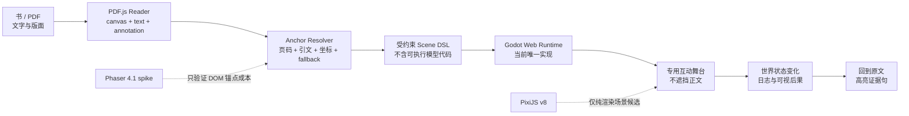
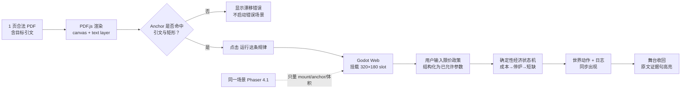

# 1BIT 参考视频、PDF 运行时与素材许可审计

> 审计日期：2026-08-07  
> 范围：只核验参考资料、官方文档、作者页面、许可与当前 Godot 样片；不修改产品代码。  
> 输入：[`pasted-text.txt`](/Users/mahaoxuan/.codex/attachments/6e50f407-f89f-4ddb-af4a-bba448b1c46b/pasted-text.txt)、[参考视频](</Users/mahaoxuan/Desktop/一本书/素材管理/人到达有多懒才想起来要做这个功能 [6a74629400000000210223c1].mp4>)、[已有开放素材研究](/Users/mahaoxuan/Desktop/一本书/research/open-source-1bit-art-libraries.md)、[当前 Godot 样片](/Users/mahaoxuan/Desktop/一本书/prototypes/one-bit-scenes-godot/README.md)。  
> 证据等级：`事实` = 一手页面或本地原件直接支持；`推断` = 多项证据一致但缺少直接声明；`建议` = 面向本项目的产品/工程判断。

## 结论先行

1. **参考物可以高置信度判断为 RottenShark Studio 的 FLINTWILDE，但不能写成“已由官方确认”。** Steam App `4748410` 的当前官方页名为 **FLINTWILDE**，开发者/发行商均为 RottenShark Studio；同一 App ID 在一个月前的 Steam 官方索引中还叫 `Idle Monotedia`。本地小红书说明文字直接称“野火深林 1BIT 挂机 RPG”，视觉、玩法和名称全部吻合，但元数据没有作者名或官方 Steam 链接，因此“视频由该开发者账号发布”仍是推断。
2. **它改变的是美术与信息反馈规范，不改变《国富论》产品机制。** 应学习严格二值画面、整数像素、双区布局、可扩展日志窗、角色轮廓和网点转场；不应复制角色、地图、窗口构图、截图或素材。
3. **不因这篇资料把现有 Godot 改写成 Phaser。** 当前 Godot 样片已经有 320×180 逻辑画布、真实换场、网点擦除、动态日志和 Web 导出。Godot 官方 Web 导出就是 `<canvas>`，并可通过自定义 HTML shell 与 `JavaScriptBridge` 接网页。当前比赛样片继续用 Godot；只有当“在真实 PDF DOM 上按段落挂载、卸载多个互动层”成为已确认产品要求时，才做 Phaser 技术 spike。
4. **PixiJS v8 不是 Phaser 的等价轻量替代。** 官方把它定义为 2D rendering engine；它有 scene graph、ticker 和 pointer events，但 v8 当前只有 WebGL/WebGPU renderer，`CanvasRenderer` 仍标记为 coming soon。它能把 GPU 画面输出到 HTML canvas，不等于拥有 Canvas 2D fallback，也不提供 Phaser/Godot 级完整游戏系统。
5. **PDF.js 能给页面、文字项和坐标原语，不能直接给“语义段落锚点”。** `getTextContent()` 返回 `str / transform / width / height` 等，viewport 能处理缩放、旋转和 PDF→canvas 坐标；但“某句话对应哪个段落矩形”“阅读顺序”“框选区域取文”需要项目自行实现，并要处理 OCR、文本碎片和非阅读顺序。
6. **“不把游戏写入 PDF bytes”仍是正确架构，但理由需更新。** PDF 标准确实支持 RichMedia；PDF.js 在 2026-06 已合入 RichMedia 音视频播放。它支持的是提取主音视频资源后用 `<video>/<audio>` 播放，不是任意 HTML 游戏、Godot/Phaser runtime 或不受限制的 PDF JavaScript。Acrobat 也会对不可信 PDF 的 JavaScript/富媒体执行做沙箱和安全提示。我们的 Reader 仍应拥有互动运行时。
7. **素材清单被混称为“开源库”，实际不是。** Kenney 两包是 CC0；1-Bit Kingdom 是免费自定义许可；1bit_UI 与 Studio Zooka 是收费自定义许可；Lospec 是第三方教程目录；Aseprite 是工具且源码受 EULA 约束。六者的法律地位不可混写。



## 一、原资料逐项拆解：事实、推断与建议

| 原资料中的主张 | 分类 | 审计结果 | 结论 |
|---|---|---|---|
| 风格是 1-bit monochrome pixel art + bitmap UI + dithering + top-down RPG tilemap | 事实 + 视觉归纳 | 视频原件确有二值像素、位图 UI、规则网点、俯视地图和上下信息区；“准确叫法”是归纳，不是单一官方类型名 | **采纳为视觉描述**，不要当作独占风格名 |
| 参考物高度疑似 FLINTWILDE / Idle Monotedia | 推断 | 当前 [Steam App 4748410](https://store.steampowered.com/app/4748410/) 为 FLINTWILDE；Steam 近期旧索引曾叫 [Idle Monotedia](https://store.steampowered.com/app/4748410/Idle_Monotedia/)；本地说明写“野火深林” | **高置信度推断，同一产品；并非账号级确认** |
| Steam 同一 app ID 在不同索引出现两个名字 | 事实，但时间敏感 | 当前 live 页面统一显示 FLINTWILDE；搜索缓存仍保留 Idle Monotedia | **写成近期改名/索引滞后，不写成当前多语言固定双名称** |
| 官方称纯 1-bit、黑白漫画/复古视觉、下半区控件集中 | 事实 | [Steam 官方页](https://store.steampowered.com/app/4748410/) 明确描述 1-BIT、monochrome manga/vintage aesthetics、vertical layout/lower half | **确认** |
| PDF.js 能渲染页面、取文字、处理坐标 | 事实 | [官方示例](https://mozilla.github.io/pdf.js/examples/) 与 [`PDFPageProxy`](https://mozilla.github.io/pdf.js/api/draft/module-pdfjsLib-PDFPageProxy.html) 支持 `render/getTextContent/getViewport/getAnnotations` | **确认，但能力边界需注明** |
| PDF 页面天然可拆为 canvas/text/annotation/game 四层 | 建议 | 前三层符合 [PDF.js 官方架构](https://github.com/mozilla/pdf.js/blob/master/AGENTS.md)；game layer 是我们的自定义 sibling/slot | **架构可行，不是 PDF.js 原生第四层** |
| 不要把游戏塞进 PDF 文件 | 建议 | PDF 2.0 有 RichMedia；PDF.js 已支持有限音视频；Acrobat 有安全限制 | **采纳，理由是可移植性、控制权和安全，而非“PDF 做不到”** |
| Phaser 是第一选择 | 主观建议 | Phaser 对 DOM/PDF 集成更轻，但当前已有可运行 Godot Web 样片 | **当前拒绝换栈；保留验证资格** |
| `pixelArt: true` 自动实现像素化 | 事实，但不完整 | [Phaser 4.1 GameConfig](https://docs.phaser.io/api-documentation/typedef/types-core) 确认其设置 `antialias=false`、`roundPixels=true`；`roundPixels` 对 `Graphics` 无效 | **确认，仍需整数画布/CSS 缩放和手动画整** |
| PixiJS 支持 WebGL/WebGPU，并能挂 canvas 到网页 | 事实，但措辞易误导 | [PixiJS v8 renderer 文档](https://pixijs.com/8.x/guides/components/renderers) 说 WebGL 推荐、WebGPU 实验、CanvasRenderer coming soon | **能输出到 canvas；当前无 Canvas 2D fallback** |
| LLM 应输出 Scene DSL，不应现场写执行代码 | 安全/架构建议 | 不属于引擎官方事实；符合最小权限和可验证状态机原则 | **采纳** |
| Kenney 1-Bit 超过 1000、CC0 | 事实 | 官方为 1078 files、16×16、CC0 | **确认** |
| Kenney Monochrome RPG 130+、CC0 | 事实 | 官方为 130 files、16×16、CC0 | **确认** |
| 1-Bit Kingdom 可商用 | 事实 | 作者页明确个人/商业可用、免署名、禁转售/再分发 | **确认；改作权未在基础包条款明确写出** |
| 1bit_UI 目前 $9，可改作商用 | 事实 | 作者页明确 $9、可商用/改作、禁原包再分发/冒充作者 | **确认（价格截至 2026-08-07）** |
| Studio Zooka $8、250 patterns/250+ icons/25 frames | 事实 | 作者页逐项确认并允许编辑后商用，禁任何形式再分发素材 | **确认（价格截至 2026-08-07）** |
| Lospec 有数百教程 | 事实 | 当前官方目录显示 **586 tutorials**，含 Pedro Medeiros 的 1-Bit 条目 | **确认；它是索引，不是统一许可素材库** |
| Aseprite 适合动画和 spritesheet | 事实 | 官方功能和文档确认；当前最低价 $19.99 | **确认；它不是开源素材库，软件禁止再分发** |
| 第一版只做一个 PDF 页面、20–60 秒互动 | 建议 | 是合理的 scope gate，不是行业事实 | **采纳为 spike，不等于最终 2 分钟演示结构** |

## 二、参考身份与视觉证据

### 2.1 能确认的事实

- 当前 [Steam App 4748410](https://store.steampowered.com/app/4748410/) 标题为 **FLINTWILDE**，开发者和发行商均为 **RottenShark Studio**。
- Steam 页面明确写出：所有怪物与 UI 使用 1-BIT 像素，灵感来自黑白漫画与复古视觉；当前英文页称为 vertical layout，控件主要集中在下半区。简体中文页还直接使用“野火深林”作为正文名称，并描述“双屏布局”。
- Steam 的近期官方索引缓存曾把同一 App ID 显示为 `Idle Monotedia`，内容、开发者、角色、玩法和视觉描述与当前页一致。这支持“近期改名”判断，但 live canonical name 应以 **FLINTWILDE** 为准。
- 本地视频为 624×932、30fps、15.8 秒；随附说明写到“战斗日志完全重写”“窗口浮动大小”“野火深林 1BIT 挂机 RPG”“Godot”。视频画面也确有俯视地图、角色/怪物、下半战斗日志和浮动结算窗。

### 2.2 仍不能确认的事实

- 本地 `.info.json` 的 `uploader` 为空，仅有小红书 `uploader_id`，没有 RottenShark Studio 名称或 Steam 链接。
- 因此，严谨表述只能是：**“该视频高置信度展示 FLINTWILDE/野火深林；尚无账号级一手证据证明上传者即开发者官方账号。”**
- 不能把 `Idle Monotedia` 当作当前正式名；它是近期官方索引留下的旧名证据。

### 2.3 可以学什么

- 严格二值图像：视觉灰度来自黑白像素密度，不来自半透明灰层。
- 世界区与日志区同时可读，日志不是聊天框，而是系统状态的可见证据。
- 窗口根据内容扩张，结算不是另开网页，而是在同一视觉语法中覆盖/收束。
- 主角、敌人和状态栏三者在一屏内拥有明确视觉层级。
- 转场使用规则网点/擦除，而非网页常见淡入淡出。

### 2.4 不可以学什么

- 不提取 Steam 截图或视频帧中的角色、怪物、地图块、UI 图标、字体图形作为项目素材。
- 不 1:1 复刻“上方战斗场 + 下方日志 + 同位置结算窗”的具体像素构图、角色造型和窗口装饰。
- 不把 `FLINTWILDE-like`、开发者名、游戏名放入公开产品文案或营销素材，避免来源混淆与暗示合作。

## 三、PDF.js：能做什么，不能做什么

### 3.1 已确认能力

官方 [Hello World 示例](https://mozilla.github.io/pdf.js/examples/) 证明页面可以按 viewport 渲染到 canvas；viewport 同时处理缩放、旋转，以及 PDF 左下原点到 canvas 左上原点的变换。

[`PDFPageProxy`](https://mozilla.github.io/pdf.js/api/draft/module-pdfjsLib-PDFPageProxy.html) 提供：

- `render()`：渲染页面；
- `getViewport()`：返回宽高和渲染所需 transform；
- `getTextContent()` / `streamTextContent()`：读取页面文本项；
- `getAnnotations()`：获取展示/打印/全部 annotation 数据；
- `getJSActions()`：读取 PDF JavaScript actions 是否存在。

[TextItem 官方类型](https://mozilla.github.io/pdf.js/api/draft/module-pdfjsLib.html) 包含 `str`、`dir`、`transform`、`width`、`height`、`fontName`、`hasEOL`。因此我们能够构造“页码 + 文本项 + 几何位置”的索引。

PDF.js 的 [官方架构说明](https://github.com/mozilla/pdf.js/blob/master/AGENTS.md) 也确认：display layer 分为 canvas rendering、text layer、annotation layer；PDF JavaScript 在 scripting layer 的 sandbox 中执行，QuickJS 是其依赖之一。

### 3.2 必须自己实现的能力

以下不是 PDF.js 已交付的语义 API：

- “这句话属于哪个自然段”；
- “把一段引文稳定映射到页面矩形”；
- “按人类阅读顺序拼回双栏、脚注、OCR 文本”；
- “给我一个矩形，直接返回里面的正文”。

PDF.js 维护者在 [Get text based on bounding box #7396](https://github.com/mozilla/pdf.js/issues/7396) 明确表示，库可返回整页 text content，但区域取文需要自定义实现。另一个官方 issue [#17191](https://github.com/mozilla/pdf.js/issues/17191) 展示了 `getTextContent()` 顺序可能跟 PDF 内部对象顺序一致，而非人类阅读顺序。鼠标坐标也必须先换算到 page/canvas 局部坐标，不能直接把 `clientX/clientY` 送进 viewport；[#6471](https://github.com/mozilla/pdf.js/issues/6471) 已说明这一点。

因此 Anchor 不能只存一句 quote。建议合同为：

```json
{
  "documentId": "sha256:…",
  "page": 23,
  "quote": "normalized source quote",
  "prefix": "up to 32 normalized chars",
  "suffix": "up to 32 normalized chars",
  "pdfRect": [72.1, 310.4, 488.8, 351.2],
  "textItemIds": [118, 119, 120],
  "resolverVersion": 1
}
```

解析顺序：`document hash + page` → quote/prefix/suffix → text-item intersection → rect fallback。若只能命中 rect 而文本不符，界面应显示“锚点可能已漂移”，不能静默把互动挂到错误段落。

### 3.3 PDF 富媒体与安全边界：更新后的结论

- [PDF 2.0 第 13 章](https://pdf-issues.pdfa.org/32000-2-2020/clause13.html) 明确定义 multimedia、3D 和 RichMedia annotations；所以“PDF 标准不支持富媒体”是错的。
- PDF.js 的旧 issue [#2787](https://github.com/mozilla/pdf.js/issues/2787) 曾记录 embedded video 不支持，但已被 2026-06-22 合入的 [PR #21474](https://github.com/mozilla/pdf.js/pull/21474) 关闭。该实现解析 RichMediaContent 的主音视频资源，点击 poster 后换成 blob URL 的 `<video>/<audio>` 元素。
- 这项新能力仍**不等于任意互动运行时**：PR 描述只覆盖主音视频资产，不是 HTML、WASM 游戏、Godot、Phaser 或任意 PDF 脚本宿主。
- [Acrobat Protected View](https://helpx.adobe.com/acrobat/desktop/protect-documents/use-protected-view/protect-view-mode.html) 会把不可信 PDF 放入 sandbox，并在信任前阻止 JavaScript 和部分修改操作；[Acrobat Media API](https://opensource.adobe.com/dc-acrobat-sdk-docs/library/jsapiref/media.html) 也明确写到媒体打开可能触发安全提示，用户设置可以改写或拒绝浮动播放器选项。

**裁决：** PDF 只承载书与标准 annotation；互动 runtime、状态、AI 调用、资源包和权限全部归 Reader。不要执行模型生成的 JavaScript/GDScript，也不要把第三方 PDF actions 当成我们的游戏指令。

## 四、Phaser、PixiJS 与 Godot 的一手能力核验

### 4.1 Phaser 4.1

[Phaser 4.1 GameConfig](https://docs.phaser.io/api-documentation/typedef/types-core) 当前确认：

- `type: Phaser.AUTO` 优先 WebGL，不可用时回退 Canvas；也可强制 CANVAS/WEBGL；
- 可以传 `parent` 或自己的 `HTMLCanvasElement`；
- 可以配置透明 canvas；
- `pixelArt: true` 会把 `antialias` 设为 `false`、`roundPixels` 设为 `true`；
- `antialias: false` 对缩放纹理使用 nearest-neighbor；
- `roundPixels` 只保证 texture-based Game Objects 取整数位置，`Graphics` 忽略它；
- Phaser 自带 scenes、input、loader、camera、animation、physics 等游戏系统。

因此 Phaser 确实比 Godot 更自然地参与 React/PDF DOM 生命周期。但它不会自动解决 paragraph anchor，也不会自动保证 CSS 端整数缩放。

### 4.2 PixiJS v8

[PixiJS 官方介绍](https://pixijs.com/8.x/guides/getting-started/intro) 将其定义为 web 2D rendering engine；[events](https://pixijs.com/8.x/guides/components/events)、[ticker](https://pixijs.com/8.x/guides/components/ticker) 和 scene graph 足以支持轻量视觉互动。

但 [renderer 官方表](https://pixijs.com/8.x/guides/components/renderers) 当前写明：

- WebGL/WebGL2：recommended；
- WebGPU：feature complete，但浏览器实现仍可能不一致，状态为 experimental；
- CanvasRenderer：coming soon。

所以“PixiJS v8 有 Canvas fallback”是错误信息。它创建/使用 HTML canvas 作为 GPU surface，不等于 Canvas 2D renderer 已可用。

### 4.3 Godot 4 Web

[Godot Web exporter](https://docs.godotengine.org/en/stable/classes/class_editorexportplatformweb.html) 明确说明 Web 项目渲染在 `<canvas>` 中；[Custom HTML shell](https://docs.godotengine.org/en/stable/tutorials/platform/web/customizing_html5_shell.html) 可以指定 canvas、resize policy、额外 HTML/CSS/JS；[JavaScriptBridge](https://docs.godotengine.org/en/stable/tutorials/platform/web/javascript_bridge.html) 可以在 Godot 与 embedding page 之间传值和回调。

这证明现有 Godot 技术上可进入 Reader。它需要被 spike 验证的风险是：

- Web build 的体积与启动时间能否满足 Reader 的按需打开要求；
- 与每个 PDF text span 共享 DOM 命中、选择、scroll/zoom 生命周期更绕；
- 一个大 canvas/iframe 适合“专用互动舞台”，不适合在每个段落上同时撒多个小 runtime。

当前本地导出提供了可复核的基线：`index.wasm` 约 36MB、`index.pck` 约 2.4MB、`index.js` 约 308KB（均为磁盘未压缩体积，不能直接等同 CDN 压缩传输量）。因此包体和首次可交互时间应进入 spike 实测，而不是凭经验直接判定 Godot 失败。

这些是待验证的集成成本，不是“Godot 不能放网页”。

## 五、素材、教程与工具许可审计

> 价格均为作者一手页面在 **2026-08-07** 的显示值；以后购买前必须重新核验。`可再分发`指原始素材或等价可提取素材，不指游戏成品中的正常打包。

| 名称 | 当前数量/规格 | 价格 | 许可性质 | 商用 | 改作 | 署名 | 原始素材再分发 | 本项目裁决 |
|---|---|---:|---|---|---|---|---|---|
| [Kenney 1-Bit Pack](https://kenney.nl/assets/1-bit-pack) | 1078 files；16×16 | 免费；可选捐赠 | [CC0 1.0](https://creativecommons.org/publicdomain/zero/1.0/) | 是 | 是 | 不要求 | CC0 法律上允许 | **Adopt：blockout/物件词典；不做最终主视觉** |
| [Kenney Monochrome RPG](https://kenney.nl/assets/monochrome-rpg) | 130 files；16×16 | 免费；可选捐赠 | CC0 1.0 | 是 | 是 | 不要求 | 允许 | **Test：补小物件；角色尺度仍偏小** |
| [1-Bit Kingdom](https://vryell.itch.io/1-bit-kingdom) | 16×16；walk/dead/attack；6 装备；7 敌人；GUI/tiles 等 | 免费下载 | 作者自定义条款 | 是 | **基础包页面未明确授权** | 不要求，作者欢迎 | 禁止 resell/redistribute | **Test with legal hold：不先改图；需要改作则向作者拿书面确认** |
| [1bit_UI](https://piiixl.itch.io/1bit-ui) | panels/windows/buttons/toggles/icons/bars/numeric display；PNG | **$9 USD 起** | 作者自定义条款 | 是 | 是，仅自己的游戏 | 不要求 | 禁止原包转售/再分发；不得声称原创 | **Test after purchase：先核实下载包是否真含展示页中的 frames/panels** |
| [Studio Zooka 1BIT 8×8](https://studiozooka.itch.io/1bit-pixel-pack) | 250 patterns；250+ icons/tiles；25 frames + pointer；PNG 8×8 | **$8 USD 起** | 作者自定义条款 | 是 | 明确可 edit | 不要求 | 禁止任何形式转售/分发素材 | **Test：Reader UI 小图标候选，不负责人物/场景** |
| [Lospec Tutorials](https://lospec.com/pixel-art-tutorials/pixel-art-tutorial-by-niklas-jansson) | 当前 586 篇；含 1-Bit、dithering、animation、tiles 等 | 目录免费；其中个别课程/书收费 | 聚合索引；每个外链作者各自版权/许可 | 逐项核验 | 逐项核验 | 逐项核验 | 默认不可复制整篇/插图 | **Adopt as learning index only** |
| [Aseprite](https://www.aseprite.org/) | pixel-perfect、frames/layers、animation tags、onion skin、PNG/JSON spritesheet | [最低 $19.99 USD](https://www.aseprite.org/faq/) | 源码与官方 binary 受 [Aseprite EULA](https://github.com/aseprite/aseprite/blob/main/EULA.txt)；不是普通开源软件 | 可用自己的作品商用 | 可制作/改自己的作品；源码修改仅个人用途边界见 EULA | 输出不要求署名软件 | **禁止再分发 Aseprite binary** | **Adopt as authoring tool；输出资产归创作者正常使用** |

### 素材表的关键纠偏

1. `开源`、`免费`、`可商用`、`可改作`、`可再分发`是五个不同字段，不能互相替代。
2. 1-Bit Kingdom 基础包只明确“可个人/商用”和“禁再分发”，没有像它的 expansion 页面那样逐项写 `Modify`；作者评论里夸赞别人编辑素材不构成稳定许可文本。
3. 1bit_UI 评论区已有购买者反映 README 提到的 sliders/frames/panels 与下载内容不一致。购买前应让作者确认当前 ZIP 清单；不能用展示图代替交付验收。
4. Lospec 的 `586` 会增长，而且条目可能只是跳到第三方网站。可以学习方法，不自动获得教程图片、示例 sprite 或文字的再利用权。
5. Aseprite 是工具，不是素材；“源码可见”也不代表可以发布自己编译的 Aseprite。

## 六、这份参考真正改变什么、不改变什么

### 6.1 对已有开放素材研究的影响

已有 [`open-source-1bit-art-libraries.md`](/Users/mahaoxuan/Desktop/一本书/research/open-source-1bit-art-libraries.md) 的 Top 3 仍成立：

- `little_bit_village`：学习历史村镇构件与负空间；
- `1-Bit Doomsphere Charset`：学习 32px 大人物轮廓与 4 帧 idle；
- `Hexany UI Panels`：学习伸缩窗口边角。

新参考没有发现一个“可整包替代原创美术”的库，反而强化了原结论：**最终画面必须统一重绘**。FLINTWILDE 的质感来自角色、地图、窗口、字体、网点、动画和信息层级构成的完整系统，不是“装一个 Kenney 包”。

这次新增的实际变化是：

- 把 UI/战斗日志从附属界面提升为美术主系统；
- 资产 spike 除了人物/建筑，还必须验证 9-slice、窗口扩张、滚动条、焦点态和 dither wipe；
- 正式资产清单必须有 `source / license / purchase receipt / modified by / export hash`；
- 付费包只在完成 ZIP 内容验收后进入正式依赖。

### 6.2 对当前 Godot 样片的影响

当前样片已经确认：

- 逻辑画布 `320×180`，窗口 1280×720；
- `canvas_items` stretch + keep aspect；
- 默认 texture filter 为 nearest；
- 四个真实场景：街口、法令室、面包房、市场；
- 0.76 秒两段 Bayer 擦除；
- 世界日志会改变高度，结算窗从日志位置长大；
- 已有 Web export；
- Fusion Pixel 中文 12px 字体带 OFL 文件。

参考视频**应推动精修**：

- 把程序化矩形小人换成原创 spritesheet 和清晰职业剪影；
- 建立统一的 tile/prop/character/UI 像素密度；
- 让日志的每条新增信息对应世界中可见事件；
- 把转场、滚动、窗口扩张和角色动作做成统一 animation timing；
- 去掉运行时的第三种语义色。当前 `overlay.gd` 使用红色结论文字，若目标是严格 1BIT，应改为反相、闪烁、边框或 dither 密度。

参考视频**不应推动这些变化**：

- 不把横向 320×180 强改成 624×932 竖屏；当前网页/demo 更适合横向舞台；
- 不把《国富论》机制改成自动战斗 RPG；
- 不把 15 秒视觉样片误当成已实现语义判定、经济 Agent 或真实用户输入；
- 不为模仿 FLINTWILDE 而重写 Godot；
- 不在正文上直接盖满游戏 canvas。

当前样片最大的产品缺口不是引擎，而是：它按固定时间播放一条预写因果链。它证明“能讲清限价→亏损→停炉→短缺”，尚未证明“用户提出非预设政策→系统理解语义→世界状态真实变化”。

## 七、引擎裁决：Godot vs Phaser vs PixiJS

评分 `5` 为当前项目更优，不是通用引擎排名。

| 决策维度 | Godot 4（现有） | Phaser 4.1 | PixiJS v8 |
|---|---:|---:|---:|
| 当前已有可运行资产/换场/动画 | **5** | 1 | 1 |
| 游戏 scene/input/state 系统 | **5** | **5** | 2 |
| 与 PDF/React DOM 逐段挂载 | 3 | **5** | **5** |
| Web 启动体积与快速 mount/unmount | 2 | 4 | **5** |
| 纯 1BIT 渲染能力 | 5 | 5 | 5 |
| Canvas 2D fallback | 不适用；WebGL canvas | **5** | **0（v8 尚未交付）** |
| 当前迁移风险 | **5** | 1 | 1 |
| 做经济模拟所需上层系统 | **5** | 4 | 2 |

### 裁决

- **Adopt Godot：** 继续承担比赛 demo 和第一个真实可玩闭环。现有代码与 Web export 是最有价值的已交付事实。
- **Test Phaser 4.1：** 只有在 Reader 需求确认后做一个隔离 spike，验证 PDF zoom/scroll、anchor、canvas mount/unmount、输入焦点、启动时间与透明背景；不先重做四场景。
- **Reject PixiJS as primary runtime：** 它适合纯视觉层，不足以抵消现有 Godot 的迁移成本；Canvas fallback 的原资料表述也不成立。若未来某类“页边轻动画”完全没有游戏状态，可局部重新评估。

不要现在实现 Godot/Phaser 双 adapter。Scene DSL 可以保持引擎无关，但第一版 runtime 只实现 Godot，等 Phaser spike 真正胜出再抽 adapter。

## 八、进入设计规范的可执行数值

### 8.1 画布与缩放

- 逻辑画布保留 **320×180**。
- 浏览器展示只允许 `1× / 2× / 3× / 4×` 整数缩放：典型为 640×360、960×540、1280×720。
- 缩放公式：`scale = max(1, floor(min(slotWidth / 320, slotHeight / 180)))`；不足 320×180 时切换移动端专用布局，不做 0.8× 等分数缩小。
- canvas、sprites、camera 和 UI 的位置/尺寸全部取整数。Phaser 的 `roundPixels` 不管 `Graphics`；Godot 自绘也要在 draw 前 round。
- CSS 或引擎纹理采样统一 nearest，禁止浏览器平滑插值。

### 8.2 二值配色

- 运行时逻辑像素只能是 `0/1` 两值；推荐 palette LUT：`INK #151515`、`PAPER #F6F1DF`，以便与书页融合。
- 不使用灰色、透明阴影、渐变、blur、glow；“灰”只由黑白像素密度生成。
- 不使用当前样片的红色结论字。危险/损失状态用反相 2 帧闪烁（建议 4Hz、最多 600ms）、双框或更高 dither 密度表达。
- 网页 Reader 外壳可有更宽色域，但游戏 canvas 内保持严格二值；两者用边框和留白分层。

### 8.3 Dither 与转场

- 只允许固定 **4×4 Bayer** 矩阵；静态阴影使用 25% / 50% / 75% 三档，不引入随机噪点。
- 普通面材用 1 logical px cell；转场边缘可用 2×2 cell 形成更强颗粒，但整项目只能选定一种转场 cell size。
- 场景擦除：`0.35s 覆盖 + 0.08s 全黑 hold + 0.35s 揭开 = 0.78s`。
- dither edge 宽度 **18–24 logical px**；当前 18px 可保留作 A 版，再测 24px。
- 禁止每帧随机 dither，避免闪烁和视频压缩脏点。

### 8.4 字体与排版

- 中文正文/日志基线 **12 logical px**；极限最小字号 **10px**，只给序号/短状态；标题 16/24/28 三档。
- 当前 Fusion Pixel 12px（OFL）可继续作为验证字体，正式版保留许可证和字体原文件来源。
- 行高：12px 字体用 **15–16px**；每行最多约 **26 个全角字符**；日志单次新增最多 2 行。
- 数字、货币、库存必须等宽；禁用抗锯齿和分数定位。

### 8.5 UI 边框与窗口

- 基础 outer border **1px**；强调窗口可使用第二条 1px 内框，inset **2px**，禁止圆角和 CSS shadow。
- window padding：水平 **6px**、垂直 **5px**；标题条高 **12–14px**。
- 可伸缩面板必须使用经过验证的 9-slice/角边中结构，禁止直接拉伸整张像素框。
- 状态栏高度 **14–16px**；日志默认占舞台高度 **25%–32%**，事件爆发时最多扩张到 **48%**，但必须保留世界可见区。
- 同屏最多一个主 modal；modal 出现时背景用 50% Bayer，而不是 alpha 蒙层。

### 8.6 场景与角色可读性

- 每个场景最多 **3 个焦点角色**；背景群众最多 4 个，使用更低细节和更稀 dither。
- 街景角色可见宽度不小于 **24–32px（屏宽 7.5%–10%）**；关键近景角色不小于 **48–64px（屏宽 15%–20%）**。
- 角色基本母格定为 **32×32**；街景 1×，重点反馈 2×。所有缩放必须整数。
- 每个经济职业必须有三重识别：外轮廓（帽/围裙/推车）、手持物、行为动画。删掉文字标签后，5 秒内应能分清面包师/商人/居民/执法员。
- 单场专属 props 控制在 **8–14 个**；画面至少保留 30% 负空间，避免素材包式堆满。
- 最小动作合同：`idle 4 帧 @ 6fps`、`act 4–6 帧 @ 8fps`、`consequence 4–8 帧 @ 8fps`；不靠上下 bob 代替全部表演。

### 8.7 书与互动层的布局规则

- 默认不把游戏透明覆盖在正文上。PC 宽屏采用“书页 55%–60% + 互动舞台 40%–45%”或点击后进入单页 experience spread。
- 互动开始前保留原句可见；开始后正文不滚动，anchor 句用 Reader 层高亮，游戏在独立 canvas slot 运行。
- canvas 只在自身区域接收 pointer events；正文 text layer 必须继续可选择、复制和搜索。
- 互动收束后，舞台缩回，不销毁阅读位置；展示“你的动作 → 状态变化 → 原文证据句”，而不是再生成一篇解释。

## 九、盗版、许可与风格抄袭风险

### 9.1 盗版与资产供应链

- 不从网盘、GitHub 镜像、素材聚合站、预览图或视频帧获取收费包。
- 1bit_UI/Studio Zooka 购买后保存订单、购买日期、页面许可 PDF/截图、ZIP hash 和包版本；不要把原始 ZIP 提交到公开仓库。
- 构建产物中的付费 spritesheet 应避免可一键提取完整原包；是否允许引擎 atlas 打包仍需服从作者条款。
- CI、演示包、开源仓库只包含许可允许公开分发的素材。

### 9.2 许可风险

- CC0 允许商用、改作和再分发，但不授予商标、背书或第三方权利保证；仍记录来源。
- 自定义 itch.io 条款以购买时页面和下载包内 license 为准；两者冲突时暂停使用并询问作者。
- 1-Bit Kingdom 的改作权文本不够明确，不能因为“能商用”就默认能重绘后发布。
- Aseprite 生成作品可商用，但 Aseprite binary 本身不可随项目再分发。
- Lospec 教程和配图没有统一开放许可；只用于学习，不复制进产品或训练集。

### 9.3 风格抄袭风险

抽象的“1-bit、黑白、dither、像素窗”不是 FLINTWILDE 独占资产，但下列组合一旦高度近似，会产生著作权、混淆或不正当竞争风险：

- 同样的女巫/怪物轮廓与动画帧；
- 同样的地图、图标和窗口边角；
- 同样的上下区比例、状态栏位置、结算窗内容与转场时序；
- 把对方截图/帧图作为生成模型 img2img、sprite trace 或最终贴图来源。

建议建立 clean-room 记录：参考只提炼成文字规范；正式角色和 UI 从《国富论》的时代、职业和机制出发原创；保留草图、Aseprite 源文件和迭代时间线，证明不是像素级描摹。

## 十、Adopt / Test / Reject

### Adopt

- 当前 Godot 4 样片与 Web export；
- `320×180` 逻辑画布、整数缩放、nearest；
- Reader-owned runtime，不写入 PDF bytes；
- PDF.js canvas/text/annotation 作为书的底层；
- Scene DSL + schema validation + allowlist，不执行模型代码；
- 严格二值 palette、4×4 Bayer、位图字体、1px 窗口；
- `little_bit_village + Doomsphere + Hexany UI` 作为学习母版，不直接拼贴成最终美术；
- Kenney CC0 仅作 blockout/物件词典；
- Aseprite 作为正式 spritesheet/animation authoring tool；
- 为每个外部素材建立 provenance 与 license 记录。

### Test

- PDF.js quote→text-item→rect anchor 在中文双栏/OCR/缩放/旋转下是否稳定；
- Godot canvas 嵌入真实 Reader slot 后的启动时间、焦点、resize、scroll、销毁；
- Phaser 4.1 对同一 20–60 秒场景的 mount/unmount 与 anchor 成本；
- 18px vs 24px dither edge，0.78s 转场；
- 32px 人物 1×/2×可读性；
- Hexany/自绘 9-slice 日志窗从 25% 高度扩到 48% 是否不变形；
- 1bit_UI 付费 ZIP 的实际交付清单；
- Studio Zooka 8×8 icon 与 32×32 人物能否统一线宽；
- 1-Bit Kingdom 如需改作，先拿作者书面许可。

### Reject

- 现在把 Godot 全量改写为 Phaser；
- 以 PixiJS v8 作为主游戏 runtime；
- 宣称 PixiJS v8 有 Canvas 2D fallback；
- 把游戏/WASM/任意脚本嵌入 PDF bytes 作为主交付；
- 把 `getTextContent()` 当成现成段落语义 API；
- PDF→LLM→执行生成代码；
- 默认透明 canvas 覆盖正文；
- 直接抽取 FLINTWILDE 的截图、视频帧、角色、UI 或地图；
- 把“免费/可商用”写成“开源/可改作/可再分发”；
- 未购买就使用付费包展示图或盗版 ZIP。

## 十一、最小验证 spike

目标不是再做一段视频，而是用一次 **可观察的完整链路**回答“书、互动和现有 Godot 能否真的结合”。



### Spike 范围

- 一页 PDF、一处引文、一个互动入口；
- 一个 320×180 专用舞台，不盖住正文；
- 只接受 3 个可验证政策参数：最高价格、农民补贴、面粉税；自然语言只做参数解析，解析失败就追问；
- 8–12 个确定性 Agent/实体，不接开放式叙事生成；
- 20–60 秒互动；2 分钟演示用其前后各加 20–30 秒问题/洞察与结果复盘；
- 一个 Godot 版本为主；一个极简 Phaser 版本只测技术，不重做美术。

### 通过标准

1. PDF zoom `100% / 125% / 150%`、旋转 0/90° 后 anchor 仍命中；命中失败必须显式报错。
2. 正文可选择、搜索、滚动；游戏输入不劫持 Reader 快捷键。
3. Godot runtime 首次可交互时间、包体和内存有真实测量；同一设备上与 Phaser spike 对比。
4. 画布只出现两种颜色，1×/2×/3×截图无模糊像素和半灰边。
5. 去掉文字标签后，5 名目标用户中至少 4 名能识别“面包师停炉/市场缺货”；这是美术可读性验收，不是喜好投票。
6. 用户输入三个不同政策，状态必须产生三个不同且可重放的结果；同一 seed + 同一参数结果一致。
7. 日志中的每个状态变化都能在世界区找到对应可见事件；不能只有模型文字。
8. 互动结束后回到原阅读位置，并高亮支持该机制的原文句子。

### 停止条件

- 如果 Godot 在 Reader 中的首次交互、resize 或焦点问题无法在 1 天 spike 内满足通过标准，再启动 Phaser 迁移评估。
- 如果 Phaser 只在包体上更轻，但需要重建既有场景、动画、工具链且未改善 anchor/焦点，就停止迁移。
- 如果 quote anchor 在目标 PDF 上不稳定，先改为人工编辑 anchor manifest，不把 LLM 猜测坐标推入 demo。
- 如果外部素材放在同屏后线宽/角色比例明显跳变，停止混包，进入统一原创重绘。

## 最终裁决

这篇资料最有价值的部分不是“推荐 Phaser”，也不是“找到几个素材包”，而是把产品拆成两项独立能力：

1. **Reader 负责把书的引文、版面与互动入口可靠连起来；**
2. **Game runtime 负责执行可重放的世界规律，并用统一 1BIT 视觉反馈后果。**

当前应该继续用 Godot 把第二项做深，同时用一个很小的 PDF.js embedding spike 验证第一项。只有这个 spike 证明 Godot 的 DOM 集成成本真实不可接受，Phaser 才有换栈依据。美术上应把 FLINTWILDE 当作质量标杆，而不是资产来源；把开放素材当作语法教材，而不是最终拼贴包。
