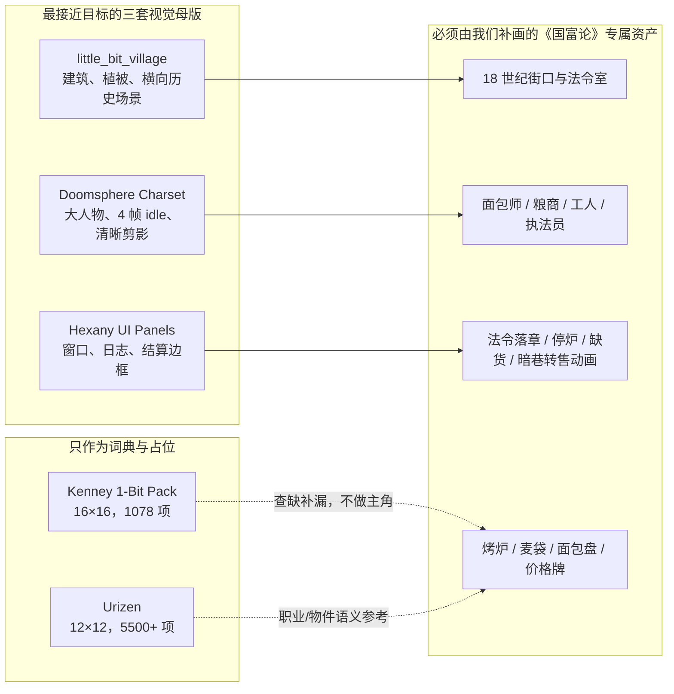
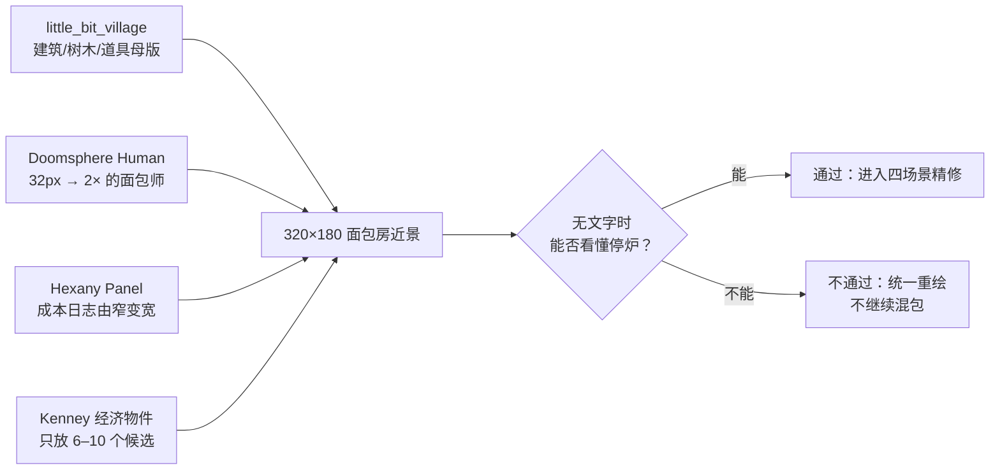

# 《国富论》1BIT 样片：开源美术库研究

> 日期：2026-08-07  
> 任务：只研究可核验的一手来源，判断哪些开放/免费商用素材能支撑当前 Godot 多场景样片的美术精修。本文不修改产品与原型代码。  
> 视觉基准：[参考视频复刻规范](./one-bit-reference-reconstruction.md)——严格黑白、统一像素网格、大人物、真实换场、可伸缩日志窗口和网点擦除。

## 结论先行

有可以直接学习、也能合法改作的开放素材，但**没有任何一套现成库能完整解决这个项目**。

当前最稳的组合不是“挑一个大包全贴上去”，而是：

1. **建筑与场景语言：`little_bit_village`**——最接近参考视频的黑底白线、横向舞台和历史村镇气质；它只有 50 个 32×32 村庄道具，因此适合做线宽、轮廓、植被和建筑构件的母版，不足以单独搭完整小镇。
2. **人物语言：`1-Bit Doomsphere Charset`**——42 个 32×32 人物、每个 4 帧 idle，人物比例和黑白轮廓最适合当前“面包师近景约屏宽 16%–20%”的需求；需要把奇幻职业重绘成面包师、粮商、工人、执法员。
3. **窗口语言：`Hexany's 1-bit UI Panels`**——12 个 96×96 纯 1BIT 面板，适合学习参考视频中黑底细边、像素化结算窗和日志窗的边框语法；不能原样把整张装饰框铺满页面，应拆成可伸缩的角、边和标题组件。

`Kenney 1-Bit Pack` 和 `Urizen` 的价值主要是**补全物件词典和快速 blockout**。它们覆盖广，但角色太小、镜头是 roguelike/top-down，直接拿来当主视觉会回到“人像小图标、画面像通用素材库”的廉价感。

## 一、许可底线

开放许可在本项目中的实际含义：

- [CC0 1.0](https://creativecommons.org/publicdomain/zero/1.0/) 允许复制、修改、分发和商业使用，无需请求许可或署名；仍不能暗示作者背书。
- [CC BY 4.0](https://creativecommons.org/licenses/by/4.0/) 允许商业使用和改作，但必须给出适当署名、许可证链接，并标明是否修改。
- “免费下载”不等于开放许可；“完整包付费、demo 免费”也不等于完整包免费。下表把获取成本和许可分开记录。

## 二、候选库许可与能力核验

| 候选 | 一手来源 | 许可与商业改作 | 原生规格 / 文件 | 场景覆盖 | 人物 / 动画 | Godot 4 导入判断 | 结论 |
|---|---|---|---|---|---|---|---|
| **little_bit_village** | [作者 itch.io 页面](https://under-score-lab.itch.io/little-bit-village) | **CC BY 4.0**；允许商用和改作，必须署名、附许可证、说明修改 | 50 个村庄 prop；32×32 网格；PNG、PSD、独立图片 | 横向村镇构件、树木、围栏等；页面提到 mill/church/farm 是计划扩展，不能当作已交付 | 未声明人物与动画 | PNG 可直接导入；PSD 只作为源文件，运行时导出 PNG；独立图片比 atlas 更快接入 | **Top 1 场景母版**。历史气质和黑底白线最接近目标，但体量小，必须原创补画建筑和室内 |
| **1-Bit Doomsphere Charset** | [作者 itch.io 页面](https://butterhands.itch.io/doomsphere-charset) / [OGA 原始条目](https://opengameart.org/content/1-bit-doomsphere-charset) | **CC0**；商用、改作允许；署名非必需 | 42 个 32×32 角色；单图和 spritesheet；每个都有白轮廓版本 | 不含环境 | 每角色 4 帧 idle；人类、骷髅、兽人等 | 32×32 sheet 可直接做 `SpriteFrames`；白轮廓版适合黑底 | **Top 1 人物母版**。尺度和动画最合适，但奇幻设定必须重绘为经济职业，不能直接贴怪物 |
| **Hexany's 1-bit UI Panels** | [作者 itch.io 页面](https://hexany-ives.itch.io/hexanys-1-bit-ui-panels) | **CC0**；页面明确允许商业/非商业项目，署名非必需 | 12 个 96×96 1BIT 面板；ZIP 24 kB | UI 专用 | 无人物 | PNG 可直接导入；应先验证角与边能否拆成 Godot `StyleBoxTexture`，不应假设原包已提供 9-slice | **Top 1 UI 母版**。最适合日志/结算窗；装饰需要削减，避免压过书和世界 |
| **Kenney 1-Bit Pack** | [Kenney 官方页面](https://kenney.nl/assets/1-bit-pack) / [OGA 原始条目](https://opengameart.org/content/1-bit-pack) | **CC0**；可免费商用和改作；署名非必需 | 16×16，1078 项；monochrome/transparent sheets；官方包带 Tiled sample maps | fantasy、urban、interior、platformer、物件、角色、UI，覆盖最广 | 小型角色；官方页未声明角色帧动画 | PNG atlas 可用 `TileSetAtlasSource`；官方包 metadata 为 16×16、tile 间距 1px；TMX 可作布局参考，Godot 内重建 TileSet 更稳 | **最佳 blockout / 物件词典**。可快速补道具，但直接当主视觉会显得通用、人物过小 |
| **Urizen 1Bit Tileset** | [作者 itch.io 页面](https://vurmux.itch.io/urizen-onebit-tileset) / [GitHub 源码](https://github.com/vurmux/urizen) | **CC0**；商用、改作允许；署名非必需 | 5500+ 个 12×12 tile；单张 PNG；作者说明 offset_x/y=1px、tile 间距 1px | medieval、modern、western 等；建筑、人物、怪物、物件、室内；40+ 种族、100+ 职业 | 页面没有给出统一动画帧合同 | 适合用 atlas + 12×12 region；需处理 1px 外边距/间距；作者页面也有 Godot 使用讨论 | **最大语义词典**。能查“银行券/职业/物件怎么用 12px 表达”，但不适合当前大人物近景直接上线 |
| **1-Bit Doomgeon Kit** | [OGA 原始条目](https://opengameart.org/content/1-bit-doomgeon-kit) | **CC0**；商用、改作允许；署名非必需 | 32×32 人物、24×24 道具、16×16 墙/地板/门；单 PNG 和 sheets | 室内地面、墙、门，主题偏 dungeon | 6 个角色；人物/道具有 4 帧 front-facing 动画 | 16/24/32 三种网格需要分三个 atlas；单 PNG 可免切图 | **Doomsphere 的室内补件**。风格统一，但内容偏地牢；可学砖墙、门、轮廓，不宜直接当法令室 |
| **Hexany's Roguelike Tiles** | [作者 itch.io 页面](https://hexany-ives.itch.io/hexanys-roguelike-tiles) | **CC0**；商用和改作允许；署名非必需 | 16×16；60+ 通用、70+ 物品、150+ 生物；有墙、水、坑的 autotile | 通用 roguelike、室内/地形/物件 | 生物很多；页面未声明动画 | 可做 16×16 atlas；作者评论显示现有命名/标注不足，集成前要做索引表 | **补图标而非主场景**。与 UI Panels 同作者但线宽未必与 96px 面板天然一致，仍需实测 |
| **1-Bit Top-Down Sprites (8×8)** | [作者 itch.io 页面](https://alex-noir.itch.io/1-bit-by-cw) | **CC BY 4.0**；商用和改作允许、须署名；**完整包 $4.99，只有 demo 免费** | 8×8；items/misc/mobs/structure 四张 sheet；TMX/TSX 示例；付费包含 Godot 4.0.3 预览源码 | town、inn、house、dungeon 等 top-down 地图 | 作者明确回复**没有动画** | 已有 Godot 4 源码证明可接入；8×8 对当前 320×180 近景太小 | **只值得研究地图信息密度**。不是零成本完整方案，也无法解决大人物和动作反馈 |
| **PIXEL PERFECT: 1-BIT BUILDINGS Part 2** | [作者 itch.io 页面](https://rad-potato.itch.io/pixel-perfect-1-bit-buildings-part-2) | 页面称 **CC0**，允许商用、改作、免署名；同页又要求“不要重新打包/转售”，与纯 CC0 语义存在冲突，实践中应遵守作者额外请求 | 30 栋 32×32 建筑；filled/no-fill；单图和 sheet | 酒店、餐馆等建筑图标，也包含现代/科幻题材 | 无人物/动画 | PNG 易导入；更像地图图标而非横向建筑构件 | **许可卫生和镜头都不够理想**。适合看“32px 如何区分建筑”，不建议作为正式依赖 |
| **OGA Sara 16×16 (1bit & Color)** | [OGA 作者原始条目](https://opengameart.org/content/oga-sara-16x16-1bit-color) | **CC0**；商用、改作允许 | 16×16 sheet，黑白和彩色两版 | 无环境 | 只有 Sara 一名角色，但包含 walk/jump/attack/death/sleep、情绪和 face closeup | sheet 可直接切为动画；需要先按实际排布建立 frame map | **动作参考价值高，覆盖极低**。可研究“极小角色如何做表情”，不能承担职业群像 |
| **1-Bit Graveyard Pack** | [OGA 原始条目](https://opengameart.org/content/1-bit-graveyard-pixel-art-asset-pack) | **CC0**；商用、改作允许 | 205 项，多数 16×16；含 55 个 UI icons；结构和 UI 可能更大 | 墓园、万圣节、哥特结构和装饰 | 页面未声明人物动画 | PNG/ZIP 可直接导入；需按混合尺寸拆 atlas | **专项目标错位**。只可借鉴稀疏纹理和 landmark，不应把哥特墓园混进 18 世纪经济小镇 |

## 三、风格匹配矩阵

评分为对当前参考视频与四场景样片的适配度，`5` 最匹配。`—` 表示该维度不适用。评分来自作者预览和包说明，是设计判断，不是作者声明。

| 候选 | 严格 1BIT | 横向/近景构图 | 历史城镇气质 | 大人物/动作 | 窗口 UI | 内容覆盖 | 最适合承担的槽位 |
|---|---:|---:|---:|---:|---:|---:|---|
| little_bit_village | 5 | 5 | 5 | 1 | 1 | 2 | 街口、树木、围栏、建筑轮廓的母版 |
| Doomsphere Charset | 5 | 4 | 2 | 5 | — | 2 | 人物体型、脸部留白、idle 节奏 |
| Hexany UI Panels | 5 | — | 3 | — | 5 | 1 | 日志、法令、结算窗边框 |
| Kenney 1-Bit Pack | 5 | 2 | 3 | 2 | 3 | 5 | 快速 blockout 和经济物件词典 |
| Urizen | 5 | 1 | 4 | 1 | 2 | 5 | 职业、建筑、商品的 12px 语义词典 |
| Doomgeon Kit | 5 | 3 | 2 | 4 | 1 | 3 | 室内砖墙/门和同系人物补件 |
| Hexany Roguelike | 5 | 1 | 2 | 2 | 2 | 4 | 小图标、物品和 autotile 参考 |
| 1-Bit Top-Down 8×8 | 5 | 1 | 3 | 1 | 1 | 4 | top-down 地图密度参考 |
| Rad Buildings | 5 | 2 | 2 | — | — | 1 | 建筑图标轮廓研究 |
| OGA Sara | 5 | 4 | 1 | 4 | — | 1 | 极小动画和表情 sheet 参考 |
| Graveyard Pack | 5 | 2 | 1 | 1 | 3 | 3 | landmark/纹理参考 |

### 为什么不选“最大包”当主美术

`Urizen` 和 `Kenney` 都非常适合做可玩的 roguelike，但当前样片的核心是让观众看见“一个人如何承担经济后果”。12×12 或 16×16 的 top-down 人物即使整数放大，也仍然缺少面包师停炉、商人犹豫、消费者争执所需的姿态信息。它们可以补“麦袋、金币、面包、账本、门”这些名词，不能替代场景构图和人物表演。

同样，直接混用多个作者的免费包会出现四个肉眼可见的问题：

1. 白色轮廓厚度不同；
2. 有的用纯黑底，有的用透明底，有的把黑色当实体色；
3. 12×12、16×16、32×32、96×96 的像素密度不一致；
4. top-down、正面、横向平台视角同时出现。

所以推荐策略是**借开放库建立视觉文法，再用同一网格重绘最终资产**，不是把开放库当拼贴素材站。

## 四、推荐的组合策略

### 1. 统一最终网格

- 当前 `320×180` 逻辑分辨率保留。
- 角色母格定为 `32×32`：街景以 1× 使用，关键近景以 2× 使用。2× 后为 64px，占 320px 屏宽的 20%，刚好落在参考视频要求的 16%–20%。
- 环境构件也优先使用 32px 模块；`Kenney 16×16` 物件可整数 2×；`Urizen 12×12` 不进入最终可见层，只作草图词典。
- 运行时只保留纯黑/纯白和规则网点；关闭 filtering，坐标和缩放保持整数。

### 2. 三套母版只负责各自的一件事

| 母版 | 学什么 | 不学什么 |
|---|---|---|
| little_bit_village | 历史村镇的横向层次、负空间、建筑/树木轮廓和白线密度 | 不照搬它的空旷程度；需要补足人和交易动作 |
| Doomsphere | 32px 人物的头身比例、外轮廓、四帧 idle 和白边处理 | 不照搬怪物、盔甲、奇幻职业；不使用与 18 世纪无关的装备 |
| Hexany UI Panels | 像素角、边、内框、标题条和黑底白线层次 | 不把整块哥特/奇幻装饰框原样放到每个窗口 |

### 3. 必须原创的最小资产

即使采用上述库，以下仍应由同一位美术规范/同一套像素约束重绘：

- `Baker`：工作、心算、停炉、离开，至少 4 组姿态；
- `Merchant`：推车、收钱、犹豫、转售；
- `Consumer`：持币、接面包、排队、争执；
- `Officer`：法令、印章、执法；
- `Bakery`：烤炉有火/熄火、烟囱有烟/停烟、满盘/空盘；
- `Market`：满货架/半空/空、普通价牌/限价牌/暗巷价牌；
- `Decree UI`：输入、语义编译、落章、规则生效；
- `Event UI`：一条日志新增、窗口扩大、事件定位、高亮回放。

这套资产才是《国富论》机制的可视化，不存在于任何通用 RPG 素材库里。

## 五、Godot 导入可行性

Godot 的稳定文档确认：`TileSetAtlasSource` 可以把一张 atlas texture 按网格暴露为 tile，[TileSet](https://docs.godotengine.org/en/stable/classes/class_tileset.html) 可供 `TileMapLayer` 使用。对本项目应采用以下最小规则：

- `little_bit_village` 独立 PNG：作为 `Sprite2D` 或场景内静态纹理，不必先做 atlas。
- `Doomsphere` 32×32 sheet：创建 `SpriteFrames`，按 4 帧 idle 切分；职业重绘仍保持相同 frame contract。
- `Hexany UI Panels` 96×96：先检查真实像素边界，再拆为角/边/中心或转成 `StyleBoxTexture`；没有验证前不要强行拉伸整图。
- `Kenney` 16×16 sheet：官方包为 1px 间距；建立 atlas 时显式配置 region 和 separation。
- `Urizen` 12×12 sheet：作者说明外偏移和间距均为 1px；若只查阅语义，不必导入正式工程。
- 所有 PNG 关闭线性过滤，使用 nearest；PSD、TMX、TSX 只保留为源文件或布局参考，不作为浏览器运行时依赖。

`1-Bit Top-Down Sprites` 的作者提供过 Godot 4.0.3 预览源码，证明该类 PNG atlas 在 Godot 4 路线可行；但它的完整包收费且没有动画，因此没有必要为当前样片购买。

## 六、最小下载验证集

下一步不应立即重做四个场景。先只下载以下四包，做一个独立的 `art-style-test`，总量不到约 1.1 MB：

1. [`little_bit_village_01.zip`](https://under-score-lab.itch.io/little-bit-village)（96 kB）——验证街景构件的线宽和负空间；
2. [`DoomsphereCharset.zip`](https://butterhands.itch.io/doomsphere-charset)（289 kB）——验证 32px 人物在 1×/2×下的可读性和 idle；
3. [`hexanys-1-bit-ui-panels-1.1.0.zip`](https://hexany-ives.itch.io/hexanys-1-bit-ui-panels)（24 kB）——验证窗口拆分与日志扩展；
4. [`Kenney 1-Bit Pack`](https://kenney.nl/assets/1-bit-pack)（16×16，1078 项）——只选 6–10 个经济相关物件，检查与前三套的线宽冲突。

### 验证样片只做一屏

### 通过标准

- 黑、白实体色只有两种；灰只来自规则网点；
- 人物 2× 后仍无模糊，面包师占屏宽约 16%–20%；
- 四套来源放在同一屏时，线宽、黑底和像素密度不发生肉眼跳变；如果跳变，Kenney 首先退出最终可见层；
- 去掉“面包师/停产”文字后，仍能凭帽/围裙、停炉、空盘看懂发生了什么；
- 日志面板从窄变宽时，角与边不变形；
- `ATTRIBUTION.md` 记录 CC BY 资源的作者、原始链接、许可证和修改说明。即便最后只剩 CC0，也建议保留来源清单。

## 七、最终判断

当前有足够开放素材支撑一次低成本美术验证，**不需要先买包，也不需要继续用 SVG 或通用图标**。

但开放库能提供的是：

- 1BIT 的线宽和轮廓方法；
- 32px 人物的动画节奏；
- 窗口边框和小物件词典。

它们不能提供的是《国富论》的真正画面：法令如何落到成本、一个面包师为什么停炉、短缺怎样从货架扩散到暗巷。那部分必须原创。最合理的下一步是先做一张“面包房近景美术试片”，用 Top 3 验证统一性，通过后再回填四个场景。

## 八、主项目视觉复核

在桌面浏览器中直接检查三套候选的作者预览后，正式采用时还要进一步收紧边界：

- `little_bit_village` 的价值是 32px 横向村镇构件和负空间，不是直接复制它的彩色预览、都铎式房屋或平台游戏构图；正式稿必须统一转为黑/象牙白，并按 18 世纪商业城镇重画。
- `Doomsphere` 的价值是 32×32 外轮廓、白边和四帧 idle；它的 Q 版奇幻人物并不等于目标角色。正式稿只继承 frame contract，职业、服装、头身和动作全部另画。
- `Hexany UI Panels` 的装饰性偏奇幻。它只适合验证 9-slice 和边角在窗口伸缩时不变形；正式窗口应继续使用更克制的账簿线、票据边框和印章语言，不把这套花边当产品 UI。

因此 Top 3 是**临摹与拆解对象**，不是最终运行时依赖。最终可见层应保持同一网格、同一轮廓宽度和同一位“虚拟美术指导”的重绘结果。
