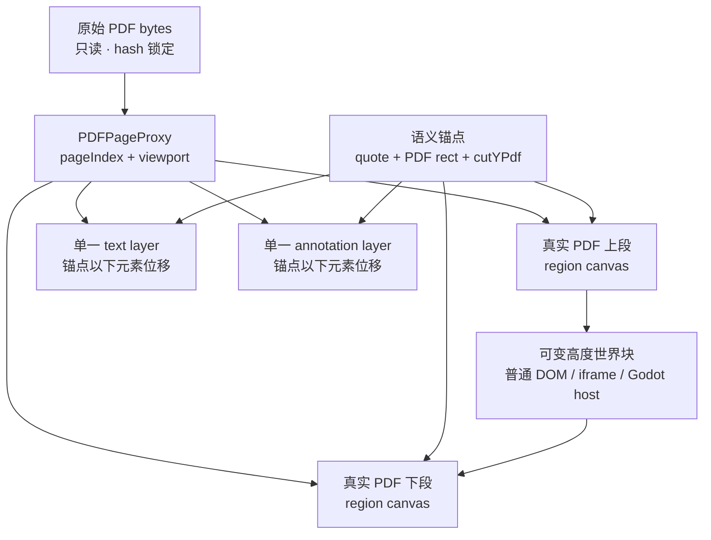
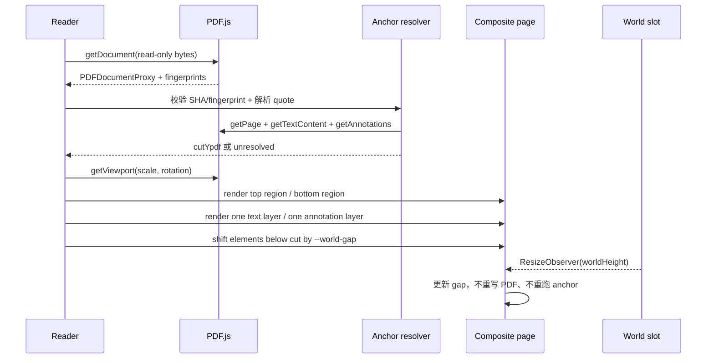
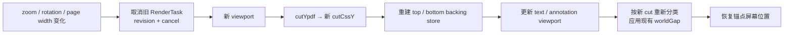

# PDF Inline Compositor：不改 PDF bytes，如何在真实书页中插入世界

> 日期：2026-08-07  
> 范围：Reader 渲染架构；不修改产品代码  
> 目标：展示真实 PDF，同时在一个目标段落之后插入可变高度、可折叠、可交互的世界块  
> 结论：**以 B `segmented page compositor` 做一个严格限界的 PoC；A 只保留为降级；C 是交付风险过高时的首选回退。**

## 1. 决策先行

“不修改 PDF bytes”与“在 PDF 中插入内容”并不矛盾，但要把两个层次说清楚：

- PDF 文件仍是只读 source of truth；Reader 不写回、不重排、不另存 PDF。
- 被改变的是网页中的**页面呈现树**：同一真实 PDF 页被沿一个 PDF 坐标切成上、下两个可见区域，中间进入普通 DOM 世界块。
- 画面仍来自 PDF.js 对原页的渲染；原文字形、页眉、脚注、边注都不是重新排版的 HTML。
- 锚点、切线与注释位置始终存为 PDF 坐标；CSS 像素只是某一次 zoom 下的投影。

推荐形态：



这不是一个通用 PDF 编辑器。它是一个**绑定到一份已知公版 PDF、少量人工校准语义锚点的阅读器**。只有在这个边界内，B 才值得做。

## 2. 公开证据：能确认什么，不能确认什么

### 2.1 PDF.js

| 公开事实 | 对本方案的含义 |
|---|---|
| PDF.js 官方示例用 `PDFPageProxy.getViewport()` 得到尺寸与坐标变换，再用 `page.render()` 把真实页渲染到 canvas；viewport 同时处理 scale、rotation 与 PDF 左下原点到 canvas 左上原点的变换。[官方示例](https://mozilla.github.io/pdf.js/examples/) | 视觉页不需要转成图片资产或手工 HTML；切线必须从 PDF 坐标投影到当前 viewport。 |
| `PDFPageProxy` 正式提供 `getTextContent()`、`streamTextContent()`、`getAnnotations()`、`getViewport()` 和 `render()`。[官方 API](https://mozilla.github.io/pdf.js/api/draft/module-pdfjsLib-PDFPageProxy.html) | canvas、可选择文字、链接/注释可以分别构造，不必写入 PDF。 |
| 与仓库当前 vendored 版本一致的 PDF.js `v4.10.38` 中，`PageViewport` 明确提供 PDF↔viewport 坐标转换。[源码](https://github.com/mozilla/pdf.js/blob/v4.10.38/src/display/display_utils.js#L114-L288) | anchor 应保存为 `cutYPdf`，zoom 后重新投影；不能保存一次性的 CSS `top`。 |
| PDF.js 自己的 `PDFPageView` 以 `canvasWrapper → textLayer → annotationLayer` 的顺序叠层，并分别创建这些层。[层顺序](https://github.com/mozilla/pdf.js/blob/v4.10.38/web/pdf_page_view.js#L105-L108)、[层构造](https://github.com/mozilla/pdf.js/blob/v4.10.38/web/pdf_page_view.js#L896-L954) | 我们不是发明一套 PDF 渲染模型，而是在相同三层模型上增加“页内 gap”。 |
| `TextLayer` 接收 `getTextContent` / `streamTextContent` 的结果，并公开与 text items 一一对应的 `textDivs`。[源码](https://github.com/mozilla/pdf.js/blob/v4.10.38/src/display/text_layer.js#L30-L32)、[textDivs](https://github.com/mozilla/pdf.js/blob/v4.10.38/src/display/text_layer.js#L248-L262) | 可以在完成官方文字定位后，对锚点以下的 span 统一位移，保留浏览器文字选择。 |
| 官方 annotation builder 用 `getAnnotations()` 取得内容，并以 `viewport.clone({ dontFlip: true })` 构造 annotation layer。[源码](https://github.com/mozilla/pdf.js/blob/v4.10.38/web/annotation_layer_builder.js#L100-L143) | 链接/注释必须跟随同一 viewport 与 gap 变化；不能只移动 canvas。 |
| PDF.js FAQ 明确不建议一次持有大量高分辨率 canvas，并建议只渲染可见页；同页 canvas 在 HiDPI 下会迅速占用数十 MB。[FAQ](https://github.com/mozilla/pdf.js/wiki/frequently-asked-questions#i-want-to-render-all-100-pages-in-a-document-at-a-high-resolution-is-it-a-good-idea) | 必须 lazy render、取消过期任务、释放离屏 canvas；不能预渲染整本书。 |

事实边界：PDF.js 能提供页面、文字与注释的分层能力，但没有“在 PDF 页内插入任意 DOM block”的官方组件。`segmented compositor` 是基于这些公开 primitive 的项目层实现。

### 2.2 Zotero

| 公开事实 | 对本方案的含义 |
|---|---|
| Zotero Reader 是公开的 PDF/EPUB/HTML reader，并包含自己的 PDF.js。[仓库](https://github.com/zotero/reader) | “真实 PDF canvas + DOM 交互层”已经被成熟阅读器采用。 |
| Zotero 当前源码明确说明：page canvas 保持 pristine PDF.js output；高亮、选择、搜索结果等用定位在 canvas 上方的 DOM overlay 绘制。[固定提交源码](https://github.com/zotero/reader/blob/37a09465ca0b4f4c6ca2781c373ccf66d6c54309/src/pdf/page.js#L39-L54) | A overlay 技术上成熟，但它不会给世界块腾出真实文档流空间。 |
| Zotero 用 viewport 的 `convertToViewportPoint()` / `convertToPdfPoint()` 在 PDF 坐标与显示坐标之间互转。[固定提交源码](https://github.com/zotero/reader/blob/37a09465ca0b4f4c6ca2781c373ccf66d6c54309/src/pdf/lib/coordinates.js#L1-L66) | anchor 与 annotation 都应保存在 PDF 坐标，zoom 只改变投影。 |
| Zotero 已公开实现“区域渲染”：先为目标 PDF rect 计算 viewport，再用负 offset 把区域移到 canvas 原点，最后只创建该区域大小的 canvas。[固定提交源码](https://github.com/zotero/reader/blob/37a09465ca0b4f4c6ca2781c373ccf66d6c54309/src/pdf/pdf-renderer.js#L67-L125) | B 的上下页段无需先把 PDF 写成两份；可分别以 offset viewport 渲染。 |
| Zotero 官方文档警告：外部删除、重排或旋转页面会让 annotations 出现在错误页或错误位置。[官方文档](https://www.zotero.org/support/pdf_reader#using_an_external_pdf_reader) | anchor drift 是真实风险。必须锁定 PDF fingerprint/hash，而不是只认书名与印刷页码。 |

### 2.3 Vibero

可确认的产品事实：Vibero 官方称其“基于 Zotero”，提供 interactive canvas、non-linear reading、key-points navigation，并强调把论文变成可交互 AI 画布。[Vibero 官方站](https://vibero.dev/en) 其公开演示文案还明确主张“原文优先，AI 辅助”，在静态 PDF 上生成逐段、可交互的总结与翻译。[公开演示](https://www.bilibili.com/video/BV12JcXzVESq/)

不能确认的事实：Vibero 没有公开其 PDF compositor 源码。仅凭成品画面，无法断言它使用了“两次 region render”“位移 text layer”或任何特定 DOM 算法。

因此本项目可以借鉴其**可见行为**：原文仍在场、辅助内容贴着目标段落、块可展开；不能把下面的 B 算法写成“Vibero 的实现”。它是我们的工程推断。

## 3. 三种方案比较

| 方案 | 页面是否真的腾出高度 | PDF 视觉真实性 | 文字选择/链接 | zoom 风险 | 两分钟演示效果 | 结论 |
|---|---:|---:|---:|---:|---:|---|
| A. 旁注 overlay | 否 | 高 | 最容易保留 | 低 | 世界像批注或广告浮层 | 只作失败降级 |
| B. Segmented page compositor | **是** | 高 | 可保留，但需专门处理 | 高 | 世界从原文中长出，最接近目标 | **做限界 PoC** |
| C. Experience spread | 在页间/对页展开，不切正文 | 高 | 易保留 | 中低 | 视觉最稳、舞台最大，但不是逐段插入 | B 不过关时首选回退 |

### A. 旁注 overlay

完整 page canvas 不动，世界作为绝对定位层或页边抽屉出现。

- 优点：直接复用 PDF.js/Zotero 的成熟模型；文字与 annotation 不需要重排。
- 致命问题：世界覆盖原文、挤到页外或缩成小卡片。它在语义上仍是“给 PDF 加旁注”，不是世界从书里生长。
- 适用：anchor 无法解析、窄屏、打印模式、低性能设备的降级。

### B. Segmented page compositor

同一页被显示为三个连续 block：上段 PDF、世界、下段 PDF。上下段仍来自同一 `PDFPageProxy`。

- 优点：只有它同时满足“真实 PDF”与“目标段落处真正插入可变高度世界”。
- 风险：需要同步处理 canvas、text layer、annotation layer、zoom、selection、anchor drift。
- 边界：固定 edition、固定少量 anchors、现代桌面浏览器。不要一开始做任意 PDF 上传。

### C. Experience spread

PDF 页保持完整；点击段落后，在下一张 spread 或对页展开世界，原文锚点与世界用书脊/引线连接。

- 优点：最稳，Godot/Canvas 可获得完整舞台；移动端也容易降级为上下页。
- 代价：不是严格的 inline insertion。
- 使用条件：B 的 selection、zoom 或 anchor 稳定性在规定时间内不过关时，直接切 C，不退回廉价 overlay。

## 4. B 的状态与数据合同

### 4.1 不变量

1. `pdfBytes` 永远只读；Reader 没有 PDF write/save path。
2. `anchor` 保存 PDF 坐标和原文指纹，不保存 CSS 像素。
3. top 与 bottom 必须来自同一个 `PDFPageProxy`、同一次 PDF 版本校验。
4. world 高度只改变网页布局，不改变 PDF page coordinate system。
5. anchor 无法唯一解析时 fail closed；不猜一个“差不多”的 y。

### 4.2 Anchor manifest

建议最小结构：

```text
AnchorManifest
  editionId
  fileSha256
  pdfFingerprint
  pageIndex            // zero-based PDF page index
  quote                 // 归一化后的短原文
  prefix / suffix       // 消歧上下文
  textItemRange         // 构建时记录，非唯一真相
  anchorRectPdf         // 原文矩形，PDF user space
  cutYpdf               // 安全行间切线，PDF user space
  calibrationVersion
```

当前本地 PoC 可绑定：

- 文件：`assets/public-domain/wealth-of-nations-cannan-vol1.pdf`
- SHA-256：`bd6a38c77409afc3ca6be08ca67a80a397472d10cc54f75774c12a974839cbeb`
- PDF page：36（代码中的 `pageIndex = 35`）
- 锚点段落：Book I, Chapter I 第一段；结尾 quote 为 `effects of the division of labour.`
- 初始切线：该段结尾与下一段开头之间的空白。当前 PDF 在 scale 1、0° viewport 中约为 top-origin `y ≈ 364px`；这只是校准提示，运行时必须由 PDF anchor 投影得到。

## 5. B 的具体算法

### 5.1 初次装载



执行顺序：

1. 读取 bytes，校验 SHA-256；同时记录 `PDFDocumentProxy.fingerprints[0]`。官方说明 fingerprint 可用于识别文档，但“不保证唯一”，因此本项目以 SHA-256 为强校验、fingerprint 为快速校验。[PDFDocumentProxy API](https://mozilla.github.io/pdf.js/api/draft/module-pdfjsLib-PDFDocumentProxy.html)
2. `getPage(pageIndex + 1)`，取 `baseViewport = page.getViewport({ scale, rotation })`。
3. `getTextContent()`，把 `TextItem.str` 归一化后寻找 `prefix + quote + suffix` 的唯一匹配。
4. 由匹配 text items 的几何位置得到段落末尾；在它与下一行之间选择 `cutYpdf`。任何 text item 或 annotation rect 穿过切线，都视为不安全切线。
5. 建立 composite page：top canvas、world slot、bottom canvas处于正常文档流；text/annotation 保持原页 `W × H` 的坐标平面，放在覆盖整个 composite page 的外层 plane 中。

建议 DOM 骨架：

```text
article.compositePage                 // position:relative; height:H+gap
  canvas.topRegion                    // normal flow; W × cut
  section.worldSlot                   // normal flow; W × variable gap
  canvas.bottomRegion                 // normal flow; W × (H-cut)
  div.layerPlane                      // absolute; inset:0; W × (H+gap)
    div.textLayer.sourceGeometry      // W × H; overflow:visible
    div.annotationLayer.sourceGeometry// W × H; overflow:visible
```

`textLayer` / `annotationLayer` 自身必须继续保持原始 `H`。PDF.js 的很多 child position 是相对该高度的百分比；若直接把这两个 source geometry layer 改成 `H + gap`，即使不移动元素，所有 percentage `top` 也会漂移。增加高度的是外层 `layerPlane`，下半元素再单独平移。

### 5.2 Canvas 切段

设当前 CSS viewport：

```text
W = viewport.width
H = viewport.height
cut = viewport.convertToViewportPoint(xPdf, cutYpdf).y
topH = cut
bottomH = H - cut
```

上段：

- CSS canvas：`W × topH`。
- backing store：`W × topH` 再乘 `devicePixelRatio`。
- 用完整 viewport 渲染，canvas 自身裁掉切线以下内容。

下段：

- CSS canvas：`W × bottomH`。
- backing store：`W × bottomH` 再乘 `devicePixelRatio`。
- viewport 保持同一 scale/rotation，但增加 `offsetY = -cut`，把原页切线移动到这个 canvas 的 y=0。
- 这与 Zotero 公开的 region render 原理一致：目标 rect 决定 canvas 尺寸，负 offset 把原区域移到 canvas 原点。

不要创建一张永久隐藏的 full-page source canvas 再复制两次。那会在 HiDPI 下同时持有 source + top + bottom 三份像素。PoC 直接做两次 region render；如果 profiling 证明重复执行 operator list 成为瓶颈，再评估短生命周期 source canvas，复制完成后立刻 `width = height = 0` 释放。

### 5.3 Text layer：一份 DOM，锚点以下整体位移

不能把 text layer 粗暴复制两份。复制会造成：

- copy 时文字重复；
- 相同 DOM id/marked content 重复；
- 拖选可能穿进被 clip 的隐形文字。

推荐算法：

1. 用当前 viewport 和完整 `TextContent` 正常构造一个 `TextLayer`。
2. 保留 `TextLayer.textDivs` 与对应 `TextItem` 的映射。
3. 在世界未插入时测量每个 text div 相对 page 的初始 bbox。
4. `bbox.bottom <= cut - epsilon`：归上段，不移动。
5. `bbox.top >= cut + epsilon`：归下段，设置 `translate: 0 var(--world-gap)`。
6. bbox 与切线相交：anchor 校准失败；不要切字、切行或复制该 span。
7. text layer 自身仍为 `W × H`，只把 `overflow` 改为 `visible`；承载它的 `layerPlane` 高度为 `H + worldGap`。将 `.endOfContent` 也位移 `worldGap`，使选择尾端落到合成页底部。其文字仍保持一个 DOM 顺序。

结果：

- 上、下段文字都可选择、复制、搜索定位；
- 下段透明文字与下段 canvas 同步移动；
- world 展开/收起只改变 CSS 变量，不需要重新提取文字；
- 选择跨过 world gap 时，浏览器可能把上下文本当作连续选择，这是可接受行为；世界块本身不应混入复制文本。

PoC 必须显式验收：复制上段一句和下段一句各只出现一次；上下 text highlight 与字形偏差不超过肉眼可见的 1–2 px。

### 5.4 Annotation layer：同样保持一份

1. 使用 `page.getAnnotations({ intent: "display" })` 与同一 viewport 构造一份 annotation layer。
2. 对 `.annotationLayer > section` 在未位移时测量 bbox。
3. 切线以上不动；切线以下使用同一个 `--world-gap` 位移。
4. annotation rect 与切线相交时拒绝这个 cut；不要复制交互节点，否则会产生重复 id、表单状态和 link target。
5. 使用 `translate` longhand 或外层 wrapper 位移，不能覆盖 PDF.js 已写入的 `transform`。

当前目标 PDF 的 page 36 没有表单；PoC 仍应保留 annotation layer 接口。若出现 XFA、可编辑表单或跨切线 annotation，立即停止把 B 泛化到该页。

### 5.5 世界块与可变高度

world slot 是普通 DOM block，宽度跟随 PDF page 的 CSS 宽度，高度由内部内容决定：

```text
worldGap = measuredWorldHeight
compositeHeight = H + worldGap
sourceGeometryHeight = H        // 不能改成 H + worldGap
layerPlaneHeight = H + worldGap
bottomCanvas flow position = topH + worldGap
shifted text/annotations translateY = worldGap
```

用 `ResizeObserver` 监听 world block。每次高度变化只更新 composite page 上的 `--world-gap` 和总高度；不重新跑 PDF render，也不重新解析 anchor。

世界宿主合同只需要：

```text
WorldSlot
  mount(element)
  expandedHeight: auto
  state: collapsed | expanded
  emits: world:resize, world:collapse, world:expand
```

内部可以先是 DOM 占位，之后再换 Godot canvas/iframe。compositor 不读取经济世界内部状态。

### 5.6 Zoom、rotation 与容器 resize



规则：

- `cutYpdf` 不变；每次用新 viewport 投影为 `cutCssY`。
- canvas 必须重绘，text/annotation layer 必须用新 viewport 更新或重建。
- world block 不跟 PDF 字形一起做 bitmap zoom；它保持网页内容，由新的 page CSS width 决定响应式高度。
- zoom 开始前记录 anchor 的屏幕 y，完成后修正 scrollTop，避免用户视线跳走。
- 所有异步 render 带 `renderRevision`；旧 revision 结果不得写回 DOM。调用 `RenderTask.cancel()` 取消可取消的旧任务。
- 只渲染视口附近页面；页离开缓存窗口后释放 canvases。

### 5.7 Collapse / expand

推荐三个状态：

- `expanded`：世界真实高度，例如 320–680px。
- `collapsed`：保留 48–64px 的“世界折叠条”，锚点仍可发现。
- `hidden`：gap=0，恢复完整 PDF 页，只用于对照/打印。

动画期间：

- top canvas 不动；bottom canvas 因文档流自动上/下移动；
- text/annotation 下半部分通过 `--world-gap` 同步位移；
- 不重新 render canvas；
- 若当前存在非折叠文字选择，先结束动画或禁止折叠，避免 selection range 在移动中错位。

`hidden` 完成后，上下 canvas 拼接应与未切分的同 scale 原页没有可见错位；允许最多 1 个 device pixel 的舍入接缝。

## 6. Anchor drift 与失败策略

### 6.1 漂移来源

- 同一本书换了另一 edition 或另一个 PDF export；
- 页面增删、重排、旋转、crop box 改变；
- OCR/text extraction 改变，quote 不再唯一；
- font substitution 或 PDF.js 升级改变 text span bbox；
- 锚点落在跨栏、脚注、边注或跨页段落中。

### 6.2 解析优先级

1. SHA-256 完全匹配：使用校准过的 `pageIndex + cutYpdf`，同时抽查 quote。
2. SHA 不同但 edition 明确允许：在目标页用 `prefix + quote + suffix` 唯一重定位，并重新计算安全 cut。
3. 0 个或多个匹配：`anchorStatus = unresolved`。
4. unresolved 时不插入 B；切到 C experience spread，或显示完整页 + 明确“无法定位”状态。

禁止：只按印刷页码、OCR 搜索第一个命中，或在相邻行中取最近 y 后继续。

## 7. 风险表

| 风险 | 用户可见后果 | 处理 |
|---|---|---|
| text item 跨切线 | 一行文字被切开，选择错位 | 只允许行间 whitespace cut；交叉即停止 |
| annotation 跨切线 | 链接/表单被截断或重复 | 换切线；XFA/表单页不进 PoC |
| zoom 竞态 | 旧 canvas 覆盖新 scale | revision token + cancel render task |
| world 动态高度抖动 | 下半页与文字不同步 | 单一 `--world-gap` + ResizeObserver |
| DPR/舍入 | 上下段出现 1px 缝或重叠 | CSS 尺寸与 backing size 分离；cut 在 device pixel 对齐 |
| PDF fingerprint 漂移 | 世界插到错误段落 | SHA 锁定 + quote 抽查 + fail closed |
| 大量页面常驻 | 内存突增、滚动卡顿 | 仅渲染可见页与邻页；离屏 canvas 归零释放 |
| PDF.js 内部 API 变化 | text/annotation 层失效 | PoC 固定仓库已有 `4.10.38`；不要边做边升级 |
| 跨 gap 拖选 | 选择范围行为因浏览器不同 | 单段选择必须通过；跨 gap 只做兼容性记录，不作首轮 blocker |
| 无 text layer 的扫描 PDF | 可看但不可选，也无法语义定位 | 不用 OCR 猜；改用人工 PDF rect manifest 或回退 C |

## 8. 给 Luna 的可直接实现 PoC 边界

### 8.1 写入范围

只新建：

```text
prototypes/pdf-inline-compositor-poc/
  index.html
  styles.css
  app.js
  README.md
  vendor/pdfjs/        // 可复用或明确引用现有 4.10.38，不升级
```

不得修改：

- `assets/public-domain/wealth-of-nations-cannan-vol1.pdf`
- `prototypes/living-reader-v2/`
- 任何 Godot、经济模型或现有视觉 prototype

### 8.2 只做一个场景

- 仅 PDF page 36。
- 仅 Book I, Chapter I 第一段后的一个 anchor。
- 页面同时提供 `unsplit reference` 与 `segmented` 两种 debug 切换，便于肉眼比对。
- world block 只是 compositor fixture：包含 `240 / 480 / 680px` 三档高度、自动内容高度、collapse、hidden。
- zoom：至少 `80% / 100% / 125% / 150%`。
- 不接 Agent、不接 Godot、不做语音、不做整本目录、不做美术润色。

### 8.3 PoC 必须产生的可见链路


### 8.4 验收证据

1. 状态栏显示当前 PDF SHA、PDF.js 版本、`anchor=resolved`、`cutYpdf`、`cutCssY`、world height。
2. 截图：100% zoom 下，世界分别为 240 与 680px；下半页和 text selection 同步下移。
3. 截图：150% zoom 下，世界仍位于同一段落之后，不按旧 CSS top 漂移。
4. 复制测试：上段与下段各复制一句，文本不重复、不缺失。
5. hidden 测试：上下段重新拼合，与 unsplit reference 并排无明显错位。
6. 控制台无未处理 promise、无重复 DOM id、无 detached canvas 持续增长。
7. 在 README 写清本地启动命令、浏览器、已验证与未验证项。

### 8.5 停止条件

任何一项发生，就停止继续堆功能并回报：

- 本地 PDF SHA 与本文不一致；
- quote 在 page 36 不是唯一匹配；
- 找不到不穿过 text item/annotation 的安全 cut；
- 上下任一段无法进行单段文字选择；
- hidden 后出现超过 1 CSS px 的稳定接缝且无法由 device-pixel rounding 解释；
- zoom 两次以上出现 stale render 覆盖新 viewport；
- 必须修改 PDF bytes、复制原文为手写 HTML 或升级 PDF.js 才能继续；
- 为了通过 PoC 必须接入 Godot/Agent/完整产品状态。

达到停止条件后的产品决策：保留调查证据，切换 C experience spread；不要把 A overlay 包装成“inline”。

## 9. PoC 通过之后才做什么

只有上述 PoC 全部通过，才进入下一阶段：

1. 把 world fixture 换成正式 `WorldSlot` host；
2. 增加 page 45 的第二个 anchor；
3. 连接现有 Reader 的 idea/relation 状态；
4. 做移动端规则：窄屏默认 C，用户可展开为 B；
5. 最后才做 1BIT 场景、转场与两分钟 demo 编排。

这条顺序的核心是：先证明“真实书页能被可靠地打开一个洞”，再把最贵的世界塞进去。
