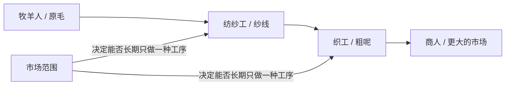

# 《国富论》粗呢外套小镇：职业美术方向与资产清单

日期：2026-08-07  
状态：首轮可集成资产；仍需目标用户盲测，不把作者自评当成验收。

## 结论

主画面不再围绕面包、价格上限或“针厂流水线”。它只表现一条来自 Book I Chapter I–III 的可运行关系：



画面必须先让读者看见“羊毛如何经过陌生人的专业化劳动变成可交易粗呢”，再让系统改变市场范围。角色不是装饰性 NPC；他们分别是经济状态机中的生产环节。

## 视觉硬约束

- 最终资产为 PNG；不以 SVG、CSS 人偶或程序矩形作为人物成品。
- 逻辑调色板只有两个不透明 RGB 色值：
  - 墨黑：`#151515`
  - 纸色：`#F6F1DF`
- 禁止灰阶、渐变、半透明、柔边、抗锯齿和模拟发光。
- 场景按 `160×90` 逻辑像素创作，以最近邻 `2×` 输出为 `320×180`。
- 独立职业图每人至少 `48×64`；不能依赖职业名、字幕、tooltip 或颜色区分。
- 同一人物的辨识顺序固定为：**外轮廓 > 大工具 > 动作轴线 > 服装细节**。
- 参考视频只用于理解“严格二值、低分辨率、信息窗之外仍有完整世界”的品类语言；不描摹其角色、构图、UI 或像素。

## 职业造型语法

| 职业 | 第一眼轮廓 | 必须占据大轮廓的工具 | 动作姿态 | 即使工具被遮住仍保留的第二信号 |
|---|---|---|---|---|
| 牧羊人 / 羊毛工 | 横向宽檐帽、长直外套、左右不对称 | 高于头部的弯牧杖；张开的羊毛剪 | 身体向原毛或羊倾斜，一只手远离躯干 | 脚边的羊 / 原毛包，外套中缝 |
| 纺纱工 | 小帽与明显的钟形下摆 | 大圆纺车；垂直落下的纺锤 | 上身向轮轴前探，一臂横向牵线 | 裙摆的三角外轮廓、脚边纱团 |
| 织工 | 身体被矩形织机框住，人物呈前倾坐姿 | 大矩形织机；横向菱形梭子 | 双臂横向穿梭，视觉轴线与其他职业相反 | 垂直经线和从织机落下的条纹布卷 |
| 商人 | 高冠帽、直立方肩长外套 | 大幅展开的双页账本；装粗呢的双轮货车 | 站得最直，账本横在胸前，另一手接货 | 钱袋、成组布卷、车轮 |
| 染工（扩展） | 卷袖围裙、上窄下宽 | 长夹具和腰部以上的大染缸 | 双臂向下压入缸内 | 不透明像素蒸汽、晾晒布匹 |
| 面包师（额外，不进主链） | 软帽与短围裙 | 长面包铲和圆形面包筐 | 双手托举或把铲子伸入炉口 | 圆面包重复形状 |

### 为什么不保留 porter 作为主角

porter 能体现运输，却不能直接解释 Page 36 与 Page 45 的主关系。首轮 Demo 只有两分钟，新增 porter 会让观察者把注意力分散到物流。运输继续由商人的双轮货车承担；后续需要解释“道路、水运扩大市场”时，再把 porter / boatman 作为第二场景角色。

## 320×180 关键帧

文件：`prototypes/living-reader-v2/assets/art/scenes/market-production-keyframe-320x180.png`

构图被压缩为四个大视觉站点，不再平均铺满五个小人：

1. 左侧：羊、原毛包、牧羊人、羊毛剪和高于头部的牧杖。
2. 中左：钟形轮廓纺纱工、大纺车、落下的纺锤与纱团。
3. 中右：织机成为最大的矩形装置，织工在框内横向推梭，布卷从机下落出。
4. 右侧：高冠商人展开账本，身后是成组粗呢卷和双轮货车。

材料沿画面从左向右连续排列，因此不需要箭头或文字标签也能读出：

`羊 / 原毛包 → 纺车 / 纱团 → 织机 / 粗呢卷 → 账本 / 货车`

背景房屋只保留屋顶、烟囱和少量边界线，不再与职业工具争夺对比度。四个角色及主工具处在同一地平线上，方便后续把库存、停工和交易变化做成可观察动画。

## 无标签可辨验收

当前只完成了创作者侧的结构自查。真正通过必须找至少 5 名未看说明的观察者执行：

1. 隐藏角色名、字幕、图例和 tooltip。
2. 先显示独立职业图 5 秒，让观察者说出“他在做什么”，不强求说出英文职业名。
3. 再显示 `320×180` 场景 5 秒，让观察者指出原毛、纺线、织布、交易的顺序。
4. 四个主职业需至少 4 人一次识别正确；场景链条需至少 4 人排对前三个生产环节。
5. 失败时只修改轮廓、工具尺度和动作，不用补文字标签绕过问题。

作者侧检查：

- 牧羊人：羊 / 原毛、羊毛剪和高牧杖形成左侧不对称轮廓。
- 纺纱工：纺车直径接近上半身高度，和钟形衣摆组成两个连续大圆形。
- 织工：唯一被大矩形机械框住的人，梭子横穿人物。
- 商人：唯一持展开白页物体并连接货车 / 成组布卷的人。

因此它们在结构上不依赖文字，但尚不能宣称已经通过用户盲测。

## 资产与来源

| 文件 | 用途 | 规格 | 来源 / 制作方式 | 权利与限制 |
|---|---|---:|---|---|
| `scenes/market-production-keyframe-320x180.png` | 粗呢外套小镇主关键帧 | 320×180 RGB PNG；严格双色 | clean-room 原创像素位图；依据书中生产分工关系从零绘制，未输入或拼贴任何参考图 | 项目原创资产；可用于参赛、演示和后续改作；不得暗示与参考游戏或其作者有关 |
| `source/generate_wool_chain_scene.mjs` | 可重复导出关键帧的像素源 | 160×90 逻辑位图，最近邻 2× 导出 | 人物由逐行手绘像素 mask 定义；脚本只负责写入无损 RGB 位图，不以几何矩形替代人物创作 | 与项目源码同权利；不含第三方像素或字体 |
| `characters/wealth-of-nations-role-sheet.png` | 六个角色的无标签轮廓比较 | 1717×916 RGB PNG；严格双色 | OpenAI `image_gen` 无参考图生成 clean-room 原创草图，再只以该自生成草图为参考重绘；本地阈值量化 | 项目生成资产；未输入第三方美术；使用时仍需遵守生成服务条款，不宣称历史肖像或他人作品 |
| `characters/shepherd.png` | 牧羊人独立职业图 | 320×560 RGB PNG；严格双色 | 从上述原创角色表裁切并居中到纸色背景 | 与角色表相同；无 Alpha |
| `characters/spinner.png` | 纺纱工独立职业图 | 320×560 RGB PNG；严格双色 | 从上述原创角色表裁切并居中到纸色背景 | 与角色表相同；无 Alpha |
| `characters/weaver.png` | 织工独立职业图 | 320×560 RGB PNG；严格双色 | 从上述原创角色表裁切并居中到纸色背景 | 与角色表相同；无 Alpha |
| `characters/dyer.png` | 染工扩展职业图 | 320×560 RGB PNG；严格双色 | 从上述原创角色表裁切并居中到纸色背景 | 与角色表相同；无 Alpha |
| `characters/merchant.png` | 商人独立职业图 | 320×560 RGB PNG；严格双色 | 从上述原创角色表裁切并居中到纸色背景 | 与角色表相同；无 Alpha |
| `characters/baker.png` | 面包师额外职业图；不进入首轮主链 | 320×560 RGB PNG；严格双色 | 从上述原创角色表裁切并居中到纸色背景 | 与角色表相同；无 Alpha |

角色图的本地后处理只做三件事：转 RGB、按灰度阈值 `160` 将像素映射为两种指定颜色、裁切并居中。没有把 Kenney、itch.io 付费包、FLINTWILDE / Idle Monotedia 的帧或网络预览图复制进本轮资产。它们至多是前期风格与许可调研对象，不是此次 PNG 的像素来源。

权利表述只覆盖“用户与 OpenAI 之间”的合同关系：当前 [OpenAI Services Agreement 第 4.1 条](https://openai.com/policies/services-agreement/) 写明，在适用法律允许范围内，客户拥有 Output，OpenAI 将其可能拥有的权利转让给客户；第 4.4 条同时提示 Output 可能不唯一。它不等同于任何国家自动确认作品具有版权，也不免除提交方检查近似、商标和第三方权利的责任。因此最终对外清单应写“clean-room 生成资产、项目可用”，不要写“全球独占原创版权已获法律确认”。

### 实际机器校验结果

| 文件组 | 颜色 | 像素格式 | Alpha | SHA-256 |
|---|---|---|---|---|
| `wealth-of-nations-role-sheet.png` | 仅 `151515` / `f6f1df` | `rgb24` | 无 | `60d5ca743b61aa0f73a9260831fb39877856d482aff7965893c3359fa73684d4` |
| `shepherd.png` | 仅 `151515` / `f6f1df` | `rgb24` | 无 | `533fb1136a6ede10efc48b8d70b46b2011760d41362047a8e79f038470c2802d` |
| `spinner.png` | 仅 `151515` / `f6f1df` | `rgb24` | 无 | `1072a617b7888fadfec2f0a976d7eaf3518065a9fcf57f3c7cbc89ad9d0cf7f4` |
| `weaver.png` | 仅 `151515` / `f6f1df` | `rgb24` | 无 | `40ce0c07355d9e11dfeae6b3d1a852ecf0eb5310d675f6f436dec13e0334afaf` |
| `dyer.png` | 仅 `151515` / `f6f1df` | `rgb24` | 无 | `1bcbed8419357dd5274796765963dbf0b8acf4d8e4df6f175b27e58be57ac399` |
| `merchant.png` | 仅 `151515` / `f6f1df` | `rgb24` | 无 | `8d754b58fed7877e8b739b2dc6c5095f132cb1fefa3e37690680da6e220739d6` |
| `baker.png` | 仅 `151515` / `f6f1df` | `rgb24` | 无 | `32f0219e5b0f8910fc49a2007ec5f398f026ac4202b56b14465f44f1afb22edc` |
| `market-production-keyframe-320x180.png` | `151515` 17,264 像素；`f6f1df` 40,336 像素 | `rgb24` | 无 | `a5f48d2c16fd3f6cfb81aef1f96a2e13f90297e476f811c7a34114ab6568a375` |

## 可重复验证

重新导出关键帧：

```bash
node prototypes/living-reader-v2/assets/art/source/generate_wool_chain_scene.mjs
ffmpeg -i prototypes/living-reader-v2/assets/art/scenes/market-production-keyframe-320x180.ppm \
  -frames:v 1 prototypes/living-reader-v2/assets/art/scenes/market-production-keyframe-320x180.png
```

检查尺寸和像素格式：

```bash
ffprobe -v error -select_streams v:0 \
  -show_entries stream=width,height,pix_fmt \
  -of default=noprint_wrappers=1 \
  prototypes/living-reader-v2/assets/art/scenes/market-production-keyframe-320x180.png
```

检查 RGB 唯一值：

```bash
ffmpeg -hide_banner -loglevel error \
  -i prototypes/living-reader-v2/assets/art/scenes/market-production-keyframe-320x180.png \
  -f rawvideo -pix_fmt rgb24 - | xxd -p -c 3 | sort | uniq -c
```

当前关键帧结果应只出现 `151515` 和 `f6f1df`。PNG 为 RGB，不含 alpha；纸色不是透明背景。

## 集成边界

本轮只交付美术资产和方向，没有修改 `index.html`、CSS、JS 或旧原型。集成时建议：

- 角色卡加载独立 PNG；场景只作为世界开场 / 状态总览，不把角色表整张塞进卡片。
- 角色图按整数倍最近邻缩放，禁止浏览器平滑插值。
- 动画首轮只需每人两种可读状态：`工作` 与 `停工 / 积压`。轮廓和工具保持不变，只改变动作与物料。
- 市场扩大时不要“把价格数字变绿”；要让纺轮、织机、货车和库存的可见状态一起改变。

## 仍未完成

- 尚未做 5 人无标签盲测，因此不能把“作者觉得能认出”写成已通过验收。
- 角色表属于高分辨率二值线刻方向，场景属于低分辨率 chunky pixel 方向；集成前应先做一张真实角色卡，判断是否统一压到同一像素密度，而不是默认混用。
- 关键帧是静态美术，不证明 Agent、经济模拟或书页联动已经实现。
